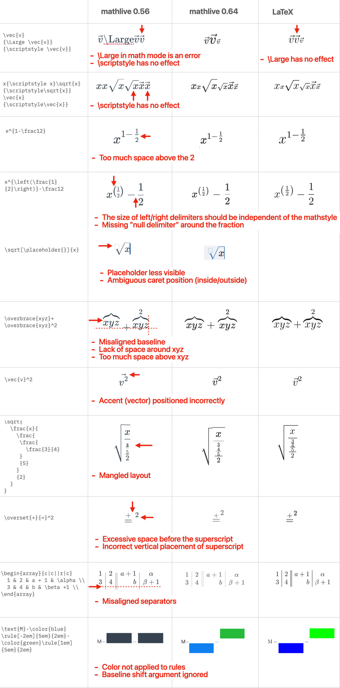

## [Unreleased]

### Bug Fixes

- **#1146** When the pointer was over a mathfield, using the scrollwheel or
  scroll gesture to scroll the page was not possible
- **#1201** In some cases, the scrim layer (used to display alternate keys in
  the virtual keyboard) was at the wrong depth
- **#951** Fixed production of sup/sub in MathML
- **#1174** The `virtual-keyboard-toggle` event was not dispatched
- **#1087** When using the virtual keyboard, the mathfield would not scroll when
  necessary

### Improvements

- Added `sounds-directory` as list of valid attributes (contributed by
  @bengolds)
- Improvements to handling of nested mathfields ("fill-in-the-blank")
  (contributed by @caleb-flores)
- Use `serve-http` instead of `http-serve` for improved Linux compatibility
  (contributed by @AceGentile)

## 0.69.7 (2021-09-13)

### New Feature

- **#1138** **PR#163** "Fill in the blank"

## 0.69.6 (2021-08-31)

### Improvements

- `vue-cli` does not support optional chaining (see
  https://github.com/vuejs/vue-loader/issues/1697) There are workarounds for
  this, but debugging and fixing this is too difficult for many users.
  Therefore, sadly, this release rolls back emitting code including optional
  chaining, despite the fact it's supported in every targeted browser, until the
  `vue` toolchain gets its act together. To be clear MathLive does not use or
  depend on `Vue`, but some users are integrating MathLive in projects that do
  use it, and this is sufficient to break MathLive. It appears that this isse
  affects also the React toolchain.

- **#1125** don't enable switching to Latex mode for read-only mathfields

### Bug Fixes

- **#1124** when setting the `inlineShortcuts` options to empty, don't fallback
  to the default shortcuts
- **#1119** `\overarc` and the `AccentAtom` family would not display their
  accent
- **#1115** Clicking in the mathfield when virtual keyboard is displayed closed
  the keyboard
- **#1117** and **#1118** Replacing a subset of a mathfield with a pattern that
  contains the target led to an infinite loop

## 0.69.5 (2021-08-05)

### Improvements

- When using keybindings or virtual keyboard keys, insert the content in the
  current math style, rather than forcing display style.

- Correctly handle loading Mathlive in a non-browser context (e.g. Node)

- Updated localization strings

## 0.69.4 (2021-06-22)

### Improvements

- Updated to ComputeEngine 0.4.2 for better parsing of Latex.
- When copying or cutting to the clipboard, if the MathJSON parsing fails,
  ignore the MathJSON and fallback to Latex. Previously, if there was a failure
  during parsing an empty MathJSON expression would be put on the clipboard,
  which result in subsequent attempts at pasting the content into a mathfield to
  fail.
- Updated various localizations (contributed by @physedo).

## 0.69.3 (2021-06-10)

### Improvements

- Added localization for Irish (contributed by @physedo).

### Bug Fixes

- **#1000** When serializing subscripts and superscripts, serialize the
  subscript first: `\int_0^{\infty}` instead of `\int^{\infty}_0`.
- In some page layouts, the virtual keyboard could be displayed at an incorrect
  location, or scroll with the page.

## 0.69.1 (2021-06-09)

### Improvements

- Attempt to fix installation of the npm package on some Windows configurations

## 0.69.0 (2021-06-09)

### Breaking Changes

- This release requires TypeScript 4.3 or later (the API uses assymetric
  getters/setters). If you are using VSCode, you may need to change the version
  of TypeScript used by the editor for language services (syntax checking). To
  do so, with a TypeScript file open, click the Typescript version in the bottom
  bar, then choose "Select TypeScript Version", then "Use Workspace Version"
  (see
  https://code.visualstudio.com/docs/typescript/typescript-compiling#_using-newer-typescript-versions)

- All the default imports have been removed. Instead of

```js
import MathLive from 'mathlive';
MathLive.renderMathInDocument();
```

use:

```js
import { renderMathInDocument } from 'mathlive';
renderMathInDocument();
```

If you are not calling a specific Mathlive function and just need to use the
`<math-field>` tag, use:

```js
import from 'mathlive';
```

- The following deprecated functions have been removed: `latexToMathML()` &rarr;
  `convertLatexToMathMl()`, `latexToSpeakableText` &rarr;
  `convertLatexToSpeakableText`, `latexToMarkup()` &rarr;
  `convertLatexToMarkup()`,
- The deprecated `revertToOriginalContent` functionality has been removed.
- The deprecated `overrideDefaultInlineShortcuts` property has been removed.
  Instead, use:

```javascript
mf.setConfig('inlineShortcuts', {
  ...mf.getConfig('inlineShortcuts'),
  ...newShortcuts,
});
```

- The following Mathfield functions have been removed: `$setConfig()` &rarr;
  `setOptions()`, `getConfig()` &rarr; `getOptions()`, `$perform()` &rarr;
  `executeCommand()`, `$text()` &rarr; `getValue()`, `$selectedText()` &rarr;
  `getValue()`, `$selectionIsCollapsed()`, `$selectionDepth()`,
  `$selectionAtStart()`, `$selectionAtEnd()`, `$latex()` &rarr;
  `getValue()`and`setValue()`, `$el`, `$insert()` &rarr; `insert()`,
  `$hasFocus()` &rarr; `hasFocus()`, `$focus()` &rarr; `focus()`, `$blur()`
  &rarr; `blur()`, `$select()` &rarr; `select()`, `$clearSelection()` &rarr;
  `executeCommand('delete-backward')`, `$applyStyle()` &rarr; `applyStyle()`,
  `$keystroke()`, `$typedText()`

- The `makeMathField()` function has been removed. Use `new MathfieldElement()`
  or the `<math-field>` tag instead:

```javascript
// Before
let mf = MathLive.makeMathField(document.createElement('div'), {
  virtualKeyboardMode: 'manual',
});
mf.$latex('f(x) = \\sin x');
document.body.appendChild(mf.$el());

// After
let mfe = new MathfieldElement({
  virtualKeyboardMode: 'manual',
});
mfe.value = 'f(x) = \\sin x';
document.body.appendChild(mfe);
```

or:

```html
<math-field virtual-keyboard-mode="manual">f(x) = \sin x</math-field>
```

## Improvements

- Added localization for Dutch (contributed by @harrisnl), Bosnian, Croatian,
  Czeck, Danish, Estonian, Finnish, Icelandic, Norwegian, Portuguese, Serbian,
  Slovak, Slovenian, Swedish, Turkish (contributed by @physedo).
- The selection can now be set using an offset, i.e. `mf.selection = 0` instead
  of `mf.selection = { ranges:[[0, 0]] }`.
- Map `\cdot` to "times" in `spoken-text` format.
- **#994** When using `virtualKeyboardContainer`, the virtual keyboard is now
  displayed **inside** the container. The container should have a `position` of
  `relative`.
- When replacing a placeholder with a Latex command in Latex mode (by pressing
  the `\` key), remove the `\placeholder{}` command.
- In spoken text, correctly handle `\mathop` and `\operatorname`.

## New Features

- The `getOffsetDepth()` method can be used to query the depth of a specific
  offset. Use `mf.getOffsetDepth(mf.position)` for the depth of the current
  position.
- the `onExport()` hook provides an opportunity to customize the format exported
  to the Clipboard.

### Bug Fixes

- Actually change the keyboard toggle glyph when changed with `setOptions`
- Reparse the formula when the `macros` dictionary is updated
- **#971** In some browsers, when mathfield elements are contained in a
  container with `overflow: scroll`, the dimensions of the viewport would be
  incorrectly affected.
- **#974** With non-US keyboard layout, always map the "/" key to a fraction.

## 0.68.1 (2021-06-02)

### Improvements

- Keybindings: keybindings can now be associated with specific keyboard layouts.
  By default, the keybindings that are specific to the US keyboard layout are no
  longer applied with other keyboard layouts. This makes it easier to use
  punctuation with some keyboard layouts and prevent some error messages from
  being thrown (addresses **#962**).

- MathML: improved MathML output, especially for formulas with unbalanced
  delimiters

### Bug Fixes

- **#969** and **#967** Changed the way the build is done so that Mathlive does
  not use MathJSON as a submodule but as a regular npm dependency, and builds
  correctly even in non-git environments.
- **#968** navigating with arrow keys cannot navigate past a macro

## 0.68.0 (2021-05-31)

### Breaking Changes

**#500** MathJSON support. The legacy MASTON/JSON format has been removed.  
 The MathJSON format is now integrated into Mathlive 🚀 🎆 🥳

To get the MathJSON representation of a formula, use `mf.getValue('math-json')`.

The `latexToAST()` and `astToLatex()` functions have been replaced by
[parseMathJson()](<https://cortexjs.io/docs/mathjson/#(parse%3Afunction)>) and
[serializeMathJson()](<https://cortexjs.io/docs/mathjson/#(serialize%3Afunction)>).

```js
import { parseMathJson, serializeMathJson } from 'mathlive';
```

MathJSON has an extensive API that supports parsing and serializing of custom
Latex expressions. You can use it to define your own Latex "vocabulary" and
"grammar" and transform it into MathJSON.

You can also convert MathJSON expressions into several canonical forms, do
symbolic computation with MathJSON expressions, for example to compare them, and
more.

Learn more at [cortexjs.io/math-json/](https://cortexjs.io/math-json/).

### New Features

- **#952** It is now possible to define variants with keycaps in a custom
  keyboard. These variants are displayed with a long press on the keycap.
- **#955** When navigating with the arrow keys but there is nowhere to go, a
  `move-out` event is dispatched (or the lower-level `onMoveOutOf` hook is
  invoked, but using the event is recommended). This is an opportunity to handle
  this situation, for example by changing the focus to another element. To get
  the default behavior, which is to play a "plonk" sound, do not cancel the
  event. To prevent the "plonk" sound from playing, use `evt.preventDefault()`.
  Note tha previously a `focus-out` event was dispatched in this case, but since
  the focus is actually not changed by default, this was incorrect.

### Improvements

- The `SpeechScope` argument of the `speak` command is now optional.
- Display the keys in the keystroke caption panel (alt/option+shift+K) in
  chronological order from left to right.
- Do not inject stylesheets or placeholder elements for the popover panel,
  keystroke caption panel or virtual keyboard until actually needed, which may
  be never and thus result in a smaller DOM.

### Architecture

- The library is now null-safe, i.e. it compiles with the Typescript flag
  `strictNullChecks`. This will ensure that the public Typescript declaration
  file also compile with `strictNullChecks` if you make use of it in your own
  project.

### Bug Fixes

- **#948** The Typescript declaration of `set plonkSound()` failed when compiled
  with `strictNullChecks`.
- When using a mathfield as a web component, the `speak` command would be
  inoperational.
- In Chrome/Blink, when a mathfield was in a `contentEditable` block, inserting
  a line before the component would make the component crash. Now the component
  is correctly disconnected, then reconnected and preserves its state across the
  disconnection.
- **#960** Typing "e^pi" would result in `e\pi` instead of `e^\pi`. Also,
  serializing some partial formulas, such as "e^" would result in incorrect
  Latex (e.g. "e").
- In MathML serialization, `2^3` was not serializing the superscript (**#951** )
  and subscripts were not serialized for various constructs( **#534**).

## 0.67.0 (2021-05-21)

### New Features

- Added `\overarc`, `\underarc`, `\overparen` and `\underparen` commands.

### Improvements

- When replacing a selected range, snapshot in the undo state the collapsed
  selection before inserting the replacement.

### Bug Fixes

- Correctly calculate the padding for enclose atoms (broken in 0.66)
- Setting the `keypressSound` to `null` would not turn off the sounds. Setting
  it to the string `"null"` did, though.
- An `input` event would incorrectly bubble out of the mathfield, even in
  read-only mode.
- When calling `getOption()`, or when examining a property on
  `MathFieldElement`, return the actual value, rather than an object literal
  that contains the value.
- If the mathlive module was loaded before the `<math-field>` element was parsed
  in the document, the attributes of the mathfield would be ignored.

## 0.66.1 (2021-05-21)

### Bug Fixes

- Revert improvements where the `display` property of the mathfield would change
  depending on the `default-mode` property. This had unintended consequences in
  some cases. To control the layout of the mathfield, use
  `style="display:inline-block;"` instead.
- When using `applyStyle()`, if a non-RGB color (e.g. `"yellow"`) was used, it
  would not be applied to the selection.
- When using `applyStyle()` if the font size was changed, it was always set to
  font size 1 (tiny).
- Macro packages were incorrectly parsed

## 0.66.0 (2021-05-20)

### Breaking Changes

- The `horizontalSpacingScale` option is deprecated. It will be removed in an
  upcoming version and replaced by the standard TeX registers `\thinmuskip`,
  `\medmuskip` and `\thickmuskip`.

### Improvements

- When the `default-mode` attribute (or the `defaultMode` property) of a
  `<math-field>` element is set to `"inline-math"`, the element will be
  displayed as an inline element. Previously, the `defaultMode` affected the
  layout of the math content, but the element still behaved as a block.
- `renderMathInDocument()` now creates a `<div>` when using Display Style, and a
  `<span>` when using Text Style (inline math).

### New Features

- **#946** Support addding a custom stylesheet to a `<math-field>` when using
  the `\class` command.
- The mathfield options which are reflected as attributes (e.g.
  `virtual-keyboard-mode`) are now reflected as a property on the element
  `mf.virtualKeyboardMode` as a shortcut to
  `mf.setOptions({virtualKeyboardMode:...}`. This also allows to set these
  properties before the component is connected to the document.
- Added the following attributes to `<math-field>`: `plonk-sound`,
  `keypress-sound`. Setting them to 'none' turn off these sounds.
- Added support for definition of macro packages (see `MacroPackageDefinition`)
- Added support to selectively expand macro definitions. This avoid expanding
  common macro definitions (for example from `amsmath.sty`) when
  copying/pasting, while still expanding custom macros for improved
  compatibility.
- Added support for MediaWiki commands:

* `\darr`
* `\dArr`
* `\Darr`
* `\lang`
* `\rang`
* `\uarr`
* `\uArr`
* `\Uarr`
* `\N`
* `\R`
* `\Z`
* `\alef`
* `\alefsym`
* `\Alpha`
* `\Beta`
* `\bull`
* `\Chi`
* `\clubs`
* `\cnums`
* `\Complex`
* `\Dagger`
* `\diamonds`
* `\empty`
* `\Epsilon`
* `\Eta`
* `\exist`
* `\harr`
* `\hArr`
* `\Harr`
* `\hearts`
* `\image`
* `\infin`
* `\Iota`
* `\isin`
* `\Kappa`
* `\larr`
* `\lArr`
* `\Larr`
* `\lrarr`
* `\lrArr`
* `\Lrarr`
* `\Mu`
* `\natnums`
* `\Nu`
* `\Omicron`
* `\plusmn`
* `\rarr`
* `\rArr`
* `\Rarr`
* `\real`
* `\reals`
* `\Reals`
* `\Rho`
* `\sdot`
* `\sect`
* `\spades`
* `\sub`
* `\sube`
* `\supe`
* `\Tau`
* `\thetasym`
* `\weierp`
* `\Zeta`

- Added support for some additional `amsmath` commands:

* `\varGamma`
* `\varDelta`
* `\varTheta`
* `\varLambda`
* `\varXi`
* `\varPi`
* `\varSigma`
* `\varUpsilon`
* `\varPhi`
* `\varPsi`
* `\varOmega`

- Added support for the `\displaylimits` command

See
[Supported TeX/LaTeX Commands](https://cortexjs.io/mathlive/reference/commands/)
for more details.

### Bug Fixes

- When a mathfield is created, then immediately removed from the document, do
  not crash. The creation of the mathfield triggered an asynchronous rendering
  and by the time the rendering was executed the mathfield was no longer valid.
  This situattion happened when using "tippyjs" and possibly other libraries.
- When a mathfield is read-only, do not display the focus outline.
- **#943** When a tooltip for a custom virtual keyboard was provided, the label
  was set to "undefined".
- The DVIPS colors were case sensitive, they should be case sensitive. (i.e.
  `LimeGreen` is a valid color, `Limegreen` is not)
- **#945** Preserve more aggresively verbatim Latex. Also, avoid serializing
  superfluous spaces in Spacing atoms.
- **#770** Correctly handle attaching limits to `\int` command using the
  keyboard.
- Return the correct `value` for the mathfield element when it is not attached
  yet, even if the output format is not specified.
- Color specified with the `rgb()` function would not render correctly if the
  arguments contained some spaces, e.g.`rgb ( 255 , 255 , 255 )`.

## 0.65.0 (2021-05-14)

### Breaking Changes

- The `substituteTextArea` option has been removed. This option was in fact not
  working so removing it will presumably have no impact.

### New Features

- **#939** Added access to `\underline`, `\underbrace`, `\xleftarrow`, etc... to
  the virtual keyboard.

### Improvements

- On iPad OS and relevant Windows devices, support the detachable keyboard.
- In Latex mode, don't consider `\\` (double-dash, i.e. end of line in tabular
  mode) as a valid command prefix.
- In Latex mode, don't recommend `\{` as a command by default.
- Added `\bigstar` symbol
- Improved performance of `renderMathInDocument()` when there are many formulas
  on the page.

### Architecture

- Renamed `Span` to `Box`.

### Bug Fixes

- When using Firefox on Windows, the layout of the formula could shift by a
  fraction of a pixel when moving the caret.
- In Latex mode with nested expressions, the edited Latex was incorrect.

## 0.64.0 (2021-05-09)

### Breaking Changes

- The `FontSize` type is now an integer between 1 and 10. It previously was
  `size1`, `size2`, etc... The default font size is `5`, the smallest is `1`.
  However, when using `applyStyle()`, the size can still be specified with
  `size1`, etc... The following size values can also be used: `tiny`,
  `scriptsize`, `footnotesize`, `small`, `normal` or `normalSize`, `large`,
  `Large`, `LARGE`, `huge`, `Huge`.
- Previously, named colors (`yellow`, `red`...) mapped to the `dvips` color set.
  They can now map to different values to improve their legibility. To ensure
  that a particular color is used, specify the colors as a hex triplet
  (`#dd2233`). See also the `colorMap` option.

  The following color names are recommended: they will map to values that have
  been optimized for legibility as a foreground or background color, they cover
  all the hues of the color circle and have been adjusted to provide similar
  apparent brightness and intensity:

  - colors: `orange`, `yellow`, `lime`, `green`, `teal`, `blue`, `indigo`,
    `purple`, `magenta`
  - shades of grey: `black`, `dark-grey`, `grey`, `light-grey`, `white`

### New Features

- The background of fractions, radicals and parentheses group (`\left`/`\right`
  commands) is now highlited when they contain the caret. This makes it easier
  to distinguish some cases when the cursor is at the edge of the element and
  could be either inside or outside. The appearance of the highliting can be
  controlled with the `--contains-highlight` CSS variable. Set it to
  `transparent` to restore the previous behavior.

- **`colorMap` option**. To map a color name such as "yellow" to a custom RGB
  color, set the `colorMap` or `backgroundColorMap` option to a function that
  takes the color name as an argument and return a matching CSS RGB string.
  Return `undefined` to proceed with the default mapping.

- In macro dictionary, added option to expand or not the macro when using the
  `latex-expanded` output format (when copying to the clipboard, for example).

- Added the `\overunderset{}{}{}` command.

- Added the `\lparen` and `\rparen` delimiters.

- Added the `\mod`, `\pmod` and `\bmod` commands, defined as macros.

- Added support for dashed column separators in matrix, using ":" in the matrix
  preamble. See the
  [arydshln](https://mirrors.ircam.fr/pub/CTAN/macros/latex/contrib/arydshln/arydshln.pdf)
  package.

- Added support for optional below argument to `\stackrel` and `\stackbin` as
  per the
  [stackrel package](http://mirrors.ibiblio.org/CTAN/macros/latex/contrib/oberdiek/stackrel.pdf)

- When using `renderMathInDocument()` or `renderMathInElement()`, ASCII Math
  format can be used. The default delimiters for ASCII Math are
  "`" (backtick) and can be changed with the `asciiMath.delimiters`option. To turn off this conversion and revert to the previous behavior, call `renderMathInDocument({
  asciiMath: null })`

### Layout Improvements

- Substantial rewrite of the stacked layout algorithm (fractions, superscripts,
  etc...). The previous algorithm did not work correctly when mixing absolute
  sizing commands (`\Huge`) and relative ones (`\scriptstyle`) and had various
  issues and inconsistenceis with what TeX produced. The result is now close to
  TeX.



- Display the placeholder symbol using the caret color.

- Added the `--smart-fence-opacity` and `--smart-fence-color` CSS variables.

- In the layout of superscript/subscript and accents, use the correct font
  metrics for spacing and layout (previously, the font metric for the base size
  was always used). This may result in very slightly different placement of
  superscripts, subscripts and limits (but closer to TeX).

- Fixed cases where the inter-atom spacing was incorrect (when spacing atoms or
  super/subscripts were used with a binary atom, or when some other atom types
  were used, such as BoxAtom and more).

### Clipboard Improvements

- When pasting from the clipboard, recognize text bracketed with
  `\begin{math}`...`\end{math}` or `\begin{displaymath}`...`\end{displaymath}`
  as LaTeX (in additon to `$`, `$$`, `\[`...`\]` and `\(`...`\)` which were
  recognized before). Also, recognize text that may contain a Latex expression
  surrounded by regular text (i.e. "if $x > 0$").

- When pasting ASCIIMath, recognize more expression using standard functions
  such as the trig functions.

- Recognize text content surrounded with "`" (backtick) delimiters as ASCII
  Math.

- When copying to the clipboard, roundtrip verbatim latex when available, i.e.
  the content of the clipboard will be exactly what has been pasted in if the
  formula has not been edited.

### Other Improvements

- The default color mapping function now returns different values when used as a
  line color or as a background color. This improves the legibility of colors.
  See
  [MathLive Guide: Customizing](https://cortexjs.io/mathlive/guides/customizing/).

- Paste operations are now undoable.

### Architecture

- Avoid generating unnecessary empty span for limits and other constructs.

- Avoid repeating color attributes on child elements by lifting them to an
  appropriate parent. As a consequence, when a background color is applied it is
  displayed more uniformly than previously.

- Reduced the size of the font-metrics table.

- Increased the number of automated and static tests.

### Bug Fixes

- The size and spacing of fractions in superscript did not match the TeX layout.
- Correctly apply TeX inter-atom spacing rules as per TeXBook p. 270. The
  spacing of two consecutive binary atoms (e.g. `+-`) was incorrect, as well as
  some other combinations.
- Correctly render `\sqrt`, `\placeholder` and many other atoms when a mathstyle
  is applied with commands such as `\textstyle`, `\scriptstyle`, etc...
- Correctly render selection rectangle of accent commands (`\widehat`).
- If a document called `renderMathInDocument()` and the document contained a
  mathfield with a value that contained exclusively an environment, the
  mathfield would not render (the `\begin{}` would be incorrectly rendered by
  `renderMathInDocument()`).
- When using `renderMathInElement()` or `renderMathInDocument()` use the same
  default `letterShapeStyle` as when using a mathfield, that is, `french` if the
  locale is French, `tex` otherwise.
- Fixed verbatim latex: when the value of the mathfield is set, if it is not
  modified, `getValue('latex')` will return exactly what was input.
- Fixed latex output of `\exponentialE`: when a superscript/subscript was
  applied to a macro, the latex output would become blank.
- Math characters with a bold italic style were displayed in regular italic.
- An input consisting of only `\scriptstyle` would crash.
- Allow navigation inside an empty `skipBoundary` atom.
- After a copy (command/control+C) command, the content of clipboard was
  incorrect if the end of the selection included some content in text mode.
- When rendering a placeholder in static mode, use a non-breaking space instead
  of nothing, which helps preserve a more accurate layout in some cases (for
  example in `\sqrt[\placeholder{}}{x}`
- Rules (e.g. from `\rule{}{}`) were not clickable and did not appear selected.
- Correctly roundtrip `\char` command when using `latex-expanded` format.

## 0.63.1 (2021-04-24)

### Bug Fixes

- On the UK QWERTY keyboard, pressing the `\` key did not switch to Latex mode.
  This key, although it looks like an ordinary key, is unique to the UK QWERTY
  keyboard and distinct from the `\` on any other keyboard. Its official name is
  `IntlBackslash`, while the other, visually identical `\` key, is the
  `Backslash` key.

## 0.63.0 (2021-04-24)

### New Features

- **#788** Added `virtualKeyboardState` property to indicate if the virtual
  keyboard is currently visible or hidden. The property can also be modified to
  show or hide the virtual keyboard.
- In read-only mode, do not attempt to load the sounds and do not allow the
  virtual keyboard to be shown.
- Export `version` (previously available as `MathLive.version`).
- **#199** Added `infty` and `int` inline shortcuts.

### Bug Fixes

- **#708** Pressing on the bottom part of the virtual keyboard keycap did not
  trigger the key action.
- The asset directory (fonts/sounds) was not properly located in some browsers
  when using a CDN to load Mathlive.
- Correctly focus the mathfield when the virtual keyboard is invoked.

## 0.62.0 (2021-04-23)

### Improvements

- **#794** When a keycap on the virtual keyboard with associated alternate keys
  is long pressed, the other UI elements on the screen are ignored (a scrim
  element is inserted behind the panel to capture events).
- On iPad OS prevent the document selection from being altered after
  long-pressing an alternate key in some cases.

### Bug Fixes

- A $$\chi_{13}$$ (0.1em) gap between the nucleus and the above element was
  missing in `OverUnder` atoms (`\overset`, etc...).
- On Safari iOS, correctly display the keyboard toggle glyph.
- **#907** When using `renderMathInElement()` or `renderMathInDocument()`,
  formulas containing styling information would get too aggressively coalesced,
  dropping some styling.
- **#910** Fixed an issue introduced in 0.61.0 where some content would not get
  rendered when calling `renderMathInElement()` or `renderMathInDocument()`.

## 0.61.0 (2021-04-22)

### Breaking Changes

- Some format options have been renamed:

  | Before                           | Now                               |
  | :------------------------------- | :-------------------------------- |
  | `"spoken-ssml-withHighlighting"` | `"spoken-ssml-with-highlighting"` |
  | `"mathML"`                       | `"math-ml"`                       |
  | `"ASCIIMath"`                    | `"ascii-math"`                    |

  The old spelling is still accepted at runtime but it has been deprecated and
  you will be removed in a future update.

### Improvements

- In many cases, the layout of the formula is closer to the TeX layout.
- Improved performance of hit testing, selection tracking and selection
  rendering for complex formulas.
- Improved accuracy of hit-testing. Prevent children of elements with a
  `captureSelection` flag from being selectable.
- More efficient rendering by generating simpler markup in some cases.
- Dropped `woff` fonts. This change should be transparent, as all supported
  browsers support `woff2` at this point.
- Apply sizing commands (e.g. `\Huge`) to math mode. TeX is inconsistent in how
  it handles those. We choose to always apply them in math mode.
- Added support for `dcases` environment: like `cases` but in `displaystyle` by
  default.
- Correctly round trip `\mbox` by avoiding wrapping it with an unnecessary
  `\text` command.

### New Features

- **#898**. Setting the `plonkSound` or `keypressSound` option to `null` will
  suppress sound feedback.
- **PR#905**. Added option to specify the container of the virtual keyboard.
  Contributed by Dominik Janković (https://github.com/djankovic). Thanks,
  Dominik!
- Simplified the specification of virtual keyboards: the `keycap` class no
  longer needs to be specified for each keycap.
- The `defaultMode` property or the `default-mode` attribute can be set to a
  value of `inline-math` to set the mathfield in inline math `\textstyle` by
  default.

### Bug Fixes

- Fixed Latex output of `\htmlData`, `\cssId` and `\class` commands.
- Ignore commands that are only applicable in some modes when they are used in
  an incorrect mode.
- Fixed styling of some characters, such as the ones from `\cdot`. The incorrect
  styling resulted in incorrect measurement and vertical layout of some
  characters.
- Fixed rendering of `\ne`, `\neq` and `\not`.
- When using `renderMathInElement()` or `renderMathInDocument()` do not
  duplicate the accessible node.
- Correctly display `e^x` and `d/dx` in the `functions` virtual keyboard
- Ensure the correct spacing around fractions.
- In Safari, the fonts would not load. This was a regression due to a change in
  the behavior of the API to test if a font is loaded. Safari lies and always
  answer yes (to prevent fingerprinting).
- Correctly parse the `\displaystyle`, `\textstyle`, `\scriptstyle` and
  `\scriptscriptstyle` commands: they apply to the commands to their right.
- In a tabular environment (matrix, etc...) `\displaystyle` applies to the
  current cell only (not the whole array).
- Moving forward in a group with the `skipBoundary` flag would not skip it.
- In a sequence of atoms with `skipBoundary`, only the first one would be
  skipped.
- In the virtual keyboard, some keycaps in the greek keyboard were displayed
  with the system font instead of the TeX font.
- The selection rectangle for `\int` now accounts for the slant of the symbol.
- When using `convertLatexToMarkup()` or `renderMathInDocument()` properly wrap
  the generated atoms in a root atom. Without it, some atoms render differently
  in static mode than in interactive mode.
- **#654** Added ASCII Math output for tabular environments (array, matrix,
  etc...)
- If the basefont of the mathfield was large (>48px) the virtual keyboard toggle
  button would not be vertically centered in the field.
- Correctly layout superscripts after `\overset` (they are adjacent, not over,
  unlike `\overbrace`).
- The `cases` environment should be in inline mode (`textstyle`) by default.
- Fixed keyboard navigation of `\overbrace`, `\underbrace`, etc...

## 0.60.1 (2021-04-13)

### New Features

- **#793**. Added '%' inline shortcut

### Bug Fixes

- **#896**. Touch events were not properly detected on FireFox.
- When using the `vite` bundler, the library location could not be determined
  correctly. As a result, the assets (fonts and sounds) could not be loaded when
  in their default location.
- **#864** Fixed layout of `\enclose{roundedbox}` and other variants.
- **#822** When using the Vue.js wrapper, the caret would jump to end of input
  field when typing a character in the middle of the formula
- When changing options with `setOptions()` avoid changing the selection unless
  necessary (react-mathlive issue #4).

## 0.60.0 (2021-04-12)

### Breaking Change

- Renamed `getCaretPosition()` and `setCaretPosition()` to `get/set caretPoint`.

  "Position" refers to where the caret/insertion point is, as an offset inside
  the expression. These methods return client screen coordinates and the new
  name better reflect the correct terminology.

- Removed deprecated (April 2019) method `enterCommandMode()`

- Replaced `ignoreSpacebarInMathMode` option with `mathModeSpace`. The
  `ignoreSpacebarInMathMode` was accidentally not working (**#859**). However,
  the boolean form is problematic as an element attribute (it defaults to true,
  but element attributes default to false). It has been replaced with
  `mathModeSpace` which is more flexible (you can specify which space to use)
  and doesn't have the issue of the default boolean value.

### New Features

- Support for _iframes_. Multiple mathfields in a single document but in
  different _iframes_ can now share a single virtual keyboard. In the main
  document, use:

  ```javascript
  makeSharedVirtualKeyboard({
    virtualKeyboardLayout: 'dvorak',
  });
  ```

  And in the _iframes_, use the `use-shared-virtual-keyboard` attribute:

  ```html
  <math-field use-shared-virtual-keyboard></math-field>
  ```

  See `examples/iframe` for more info.

  Contribution by https://github.com/alexprey. Thanks!

- **#555** Support for IME (Input Method Engines) for Japanese, Chinese, Korean
  and other complex scripts.
- `applyStyle()` has now more options. Previously it always toggled the style of
  the selection. Now it can either toggle or set the style, and modify the
  selection or a specific range.
- **#387** `find()` method to search the fragments of an expression that match a
  Latex string or regular expression.

  For example the following code snippet will add a yellow background to the
  fractions in the expression:

  ```javascript
  mf.find(/^\\frac{[^}]*}{[^}]*}\$/).forEach((x) => {
    mf.applyStyle({ backgroundColor: 'yellow' }, x, {
      suppressChangeNotifications: true,
    });
  });
  ```

- **#387** `replace()` method to replace fragments of an expression.

  This method is similar to the `replace()` method of the `String` class. The
  search pattern can be specified using a string or regular expression, and the
  replacement pattern can be a string or a function. If using a regular
  expression, it can contain capture groups, and those can be references in the
  replacement pattern.

  The following snippet will invert fractions in a formula:

  ```javascript
  mf.replace(/^\\frac{([^}]*)}{([^}]*)}$/, '\\frac{$2}{$1}');
  ```

- New **Latex Mode**

  This mode replaces the previous **Command Mode**. While the **Command Mode**
  (triggered by pressing the **\\** or **ESC** key) was only intended to insert
  a single Latex command (e.g. "\aleph"), the **Latex Mode** is a more
  comprehensive Latex editing mode.

  To enter the **Latex Mode**, press the **ESC** key or the **\\** key. While in
  this mode, a complex Latex expression can be edited. Press the **ESC** or
  **Return** key to return to regular editing mode.

  To quickly peek at the Latex code of an expression, select it, then press
  **ESC**. Press **ESC** again to return to the regular editing mode.

  To insert a command, press the **\\** key, followed by the command name. Press
  the **TAB** key to accept a suggestion, then the **RETURN** key to return to
  regular editing mode (previously pressing the **TAB** key would have exited
  the command mode).

- Added `soundsDirectory` option to customize the location of the sound files,
  similarly to `fontsDirectory`.
- Enabled audio feedback by default.

- **#707** added support for `\begin{rcases}\end{rcases}` (reverse `cases`, with
  brace trailing instead of leading)

- **#730** added new CSS variables to control the height of the virtual
  keyboard:
  - `--keycap-height`
  - `--keycap-font-size`
  - `--keycap-small-font-size` (only if needed)
  - `--keycap-extra-small-font-size` (only if needed)
  - `--keycap-tt-font-size` (only if needed)
- **#732** Support for Dvorak keyboard layout
- Synchronize the virtual keyboard layout (QWERTY, AZERTY, etc...) with the
  physical keyboard layout.

- Added `\htmlData` command, which takes as argument a comma-delimited string of
  key/value pairs, e.g. `\htmlData{foo=green,bar=blue}`. A corresponding
  `data-foo` and `data-bar` DOM attribute is generated to the rendered DOM.

### Bug Fixes

- **#805**: exponent towers did not display correctly
- **#857**: when a mathfield was in `read-only` mode, it was still possible to
  delete a portion of it by pressing the backspace key.
- **#818**: on iPad OS 14 and later, Safari pretends to be macOS ("Desktop
  Mode"). This interfered with the handling of the MathLive virtual keyboard.
- The selection in an expression could render incorrectly if it was displayed
  before the fonts were fully loaded. This situation is now handled correctly
  and the selection is redrawn when fonts finish loading.
- The `typedText` selector dropped its options argument. As a result, the sound
  feedback from the virtual keyboard only played for some keys.
- **#697** When using the `<math-field>` element the command popover did not
  display correctly.
- Fixed issues with copy/paste. Copying from a text zone will copy the text (and
  not a latex representation of it). Copy from a Latex zone now works.
- **#816** Fixed some issues with keybindings on some keyboards, such as Swiss
  German. The physical keyboard layout was not always recognized, and some
  keybindings conflicted with each other.

### Improvements

- Improved handling of paste commands: if a JSON item is on the clipboard it is
  used in priority, before a `plain/text` item.
- It is now possible to type dead keys such as `alt+e`, and they are properly
  displayed as a composition (side effect of the fix for **#555**).
- **#807** Support for AZERTY keyboard layout on Linux.

### Architecture

- **Complete rewrite of selection handling.**

  This is mostly an internal change, but it will offer some benefits for new
  capabilities in the public API as well.

  **Warning**: _This is a very disruptive change, and there might be some edge
  cases that will need to be cleaned up._

  The _position_ of the insertion point is no longer represented by a _path_. It
  is now an _offset_ from the start of the expression, with each possible
  insertion point position being assigned a sequential value.

  The _selection_ is no longer represented with a _path_ and a sibling-relative
  _offset_. It is now a _range_, i.e. a start and end _offset_. More precisely,
  the selection is an array of ranges (to represent discontinuous selections,
  for example a column in a matrix) and a direction.

  These changes have these benefits:

  - The selection related code is more expressive and much simpler to read and
    debug
  - The code is also simpler to change so that changes in UI behavior are much
    easier to implement. There are several open issues that will be much easier
    to fix now. In particular, the `onDelete` function now regroups all the
    special handling when pressing the **Backspace** and **Delete** keys.
  - Instead of the esoteric paths, the concept of position as an offset is much
    easier to explain and understand, and can now be exposed in the public API.
    Consequently, new functionality can be exposed, such as the `find()` method
    which returns its results as an array of ranges. It is also possible now to
    query and change the current selection, and to apply styling to a portion of
    the expression other than the selection.
  - The selection is represented as an _array_ of ranges to support discontinous
    selections, which are useful to select for example all the cells in the
    column of a matrix column. This kind of selection was not previously
    possible.
  - Incidentally this fixes a circular dependency, which was a smell test that
    there was a problem with the previous architecture.

  On a historical note, the reason for the original implementation with paths
  was based on the TeX implementation: when rendering a tree of atoms (which TeX
  calls _nodes_), the TeX layout algorithm never needs to find the parent of an
  atom. The MathLive rendering engine was implemented in the same way. However,
  for interactive editing, being able to locate the parent of an atom is
  frequetly necessary. The paths were a mechanism to maintain a separate data
  structure from the one needed by the rendering engine. However, they were a
  complex and clumsy mechanism. Now, a `parent` property has been introduced in
  instance of `Atom`, even though it is not necessary for the rendering phase.
  It does make the handling of the interactive manipulation of the formula much
  easier, though.

- **Changes to the handling of sentinel atoms (type `'first'`)**

  This is an internal change that does not affect the public API.

  Sentinel atoms are atoms of type `'first'` that are inserted as the first
  element in atom branches. Their purpose is to simplify the handling of "empty"
  lists, for example an empty numerator or superscript.

  Previously, these atoms where added when an editable atom tree was created,
  i.e. in the `editor` code branch, since they are not needed for pure
  rendering. However, this created situations where the tree had to be
  'corrected' by inserting missing `'first'`. This code was complex and resulted
  in some unexpected operations having the side effect of modifying the tree.

  The `'first'` atoms are now created during parsing and are present in editable
  and non-editable atom trees.

- **Refactoring of Atom classes**

  This is an internal change that does not affect the public API.

  Each 'kind' of atom (fraction, extensible symbol, boxed expression, etc...) is
  now represented by a separate class extending the `Atom` base class (for
  example `GenfracAtom`). Each of those classes have a `render()` method that
  generates a set of DOM virtual nodes representing the Atom and a `serialize()`
  method which generates a Latex string representing the atom.

  Previously the handling of the different kind of atoms was done procedurally
  and all over the code base. The core code is now much smaller and easier to
  read, while the specialized code specific to each kind of atom is grouped in
  their respective classes.

- **Unit testing using Jest snapshot**

  Rewrote the unit tests to use Jest snapshots for more comprehensive
  validation.

## 0.59.0 (2020-11-04)

### Bug Fixes

- **#685** Virtual keyboard event listeners were not properly released when the
  mathfield was removed from the DOM

## 0.58.0 (2020-10-11)

### New Features

- **#225** Added `onCommit` listener to `mf.options`. This listener is invoked
  when the user presses **Enter** or **Return** key, or when the field loses
  focus and its value has changed since it acquired it. In addition, a `change`
  event is triggered when using a `MathfieldElement`. The event previously named
  `change` has been renamed to `input`. This mimics the behavior of `<input>`
  and `<textarea>` elements.
- **#225** Changed the keyboard shortcuts to add columns and rows:

  | Shortcut                                            | Command           |
  | :-------------------------------------------------- | :---------------- | --- | ------------------------------ | ---------------- | --- |
  | **ctrl**/**cmd** + **Return**/**Enter**             | `addRowAfter`     |     |
  | **ctrl**/**cmd** + **shift** + **Return**/**Enter** | `addRowBefore`    |     |
  | **ctrl**/**cmd** + **;**                            | `addRowAfter`     |     | **ctrl**/**cmd** + **shift** + |
  | **;**                                               | `addRowBefore`    |     | **ctrl**/**cmd** + **,**       | `addColumnAfter` |     |
  | **ctrl**/**cmd** + **shift** + **,**                | `addColumnBefore` |

  Note that **Enter**/**Return** no longer create a matrix/vector when inside a
  parenthesized expression. Use **ctrl/cmd** + **Return**/**Enter** instead.

- Added a `commit` command to programmatically trigger the `onCommit` listener
  `change` event.
- Added `mount` and `unmount` events to `MathfieldElement`
- The `$text()` method, which is deprecated, was accidentally prematurely
  removed. It has been added back.

### Bug Fixes

- Inline shortcuts would not always be triggered correctly, for example `x=sin`
  &rarr; `x\sin` instead of `x=\sin`
- The text in tooltip was not vertically centered in narrow layouts (mobile
  devices)
- **#668** Extensible symbols, such as `\xrightarrow` were incorrectly treated
  as if they had an invisible boundary, resulting in the cursor being positioned
  incorrectly when navigating with the keyboard.

## 0.57.0 (2020-10-09)

### Major New Feature

This release introduce two major new features which will require code changes.
For now, the older API remains supported but it will be dropped in an upcoming
release.

#### **#665: Web Component**

Support for `MathfieldElement` custom element/web component and `<math-field>`
tag.

The `makeMathField()` function is still supported, but it will be removed in an
upcoming version. You should transition to using `<math-field>` or
`MathfieldElement` instead.

This transition require the following changes:

1.  Create mathfields using `MathfieldElement` or declaratively

```javascript
// Before
let mf = MathLive.makeMathField(document.createElement('div'), {
  virtualKeyboardMode: 'manual',
});
mf.$latex('f(x) = \\sin x');
document.body.appendChild(mf.$el());

// After
let mfe = new MathfieldElement({
  virtualKeyboardMode: 'manual',
});
mfe.value = 'f(x) = \\sin x';
document.body.appendChild(mfe);
```

or:

```html
<math-field virtual-keyboard-mode="manual">f(x) = \sin x</math-field>
```

2.  Use events instead of callbacks

```javascript
    // Before
    mf.setConfig({ onContentDidChange: (mf) => {
        console.log(mf.$latex())
    });

    // After
    mfe.addEventListener('input', (ev) => {
        console.log(mfe.value);
    });
```

#### **#667 Modernized Public API**

Support for web component is an opportunity to revisit the MathLive public API
and modernize it.

The goals are:

- clarity. For example, the `$latex()` can be used to read or change the content
  of the mathfield.
- expressiveness. For example, `$selectedText()` can return the value of the
  selection, but there is no way to inspect (or save/restore) the selection.
- consistency with web platform APIs when applicable, otherwise following the
  [**monaco**](https://github.com/Microsoft/monaco-editor/blob/master/monaco.d.ts)
  (VSCode editor) or
  [**CodeMirror**](https://codemirror.net/doc/manual.html#api) conventions
  primarily. As part of this proposal, the APIs of **TinyMCE**, **CKEditor** and
  **QuillJS** were also considered. For example, the method equivalent to
  `getConfig()` is called `getOptions()` in most Javascript text editor
  libraries.

**Mathfield methods**

The following `Mathfield` methods have been renamed as indicated:

| Before                       | After                                  |
| :--------------------------- | :------------------------------------- |
| `$setConfig()`               | `setOptions()`                         |
| `getConfig()`                | `getOptions()` and `getOption()`       |
| `$text()`                    | `getValue()`                           |
| `$latex()`                   | `value`, `getValue()` and `setValue()` |
| `$insert()`                  | `insert()`                             |
| `$hasFocus()`                | `hasFocus()`                           |
| `$focus()`                   | `focus()`                              |
| `$blur()`                    | `blur()`                               |
| `$selectedText()`            | `mf.getValue(mf.selection)`            |
| `$selectionIsCollapsed()`    | `mf.selection[0].collapsed`            |
| `$selectionDepth()`          | `mf.selection[0].depth`                |
| `$selectionAtStart()`        | `mf.position === 0`                    |
| `$selectionAtEnd()`          | `mf.position === mf.lastPosition`      |
| `$select()`                  | `select()`                             |
| `$clearSelection()`          | `executeCommand('delete-backward')`    |
| `$keystroke()`               | `executeCommand()`                     |
| `$typedText()`               | `executeCommand('typed-text')`         |
| `$perform()`                 | `executeCommand()`                     |
| `$revertToOriginalContent()` | n/a                                    |
| `$el()`                      | n/a                                    |
| n/a                          | `selection`                            |
| n/a                          | `position`                             |

The methods indicated with "n/a" in the **After** column have been dropped.

Only the new methods are available on `MathfieldElement` (i.e. when using web
components). The `Mathfield` class retains both the old methods and the new ones
to facilitate the transition, but the old ones will be dropped in an upcoming
version.

There is also a new `selection` property on `Mathfield` and `MathfieldElement`
which can be used to inspect and change the selection and a `position` property
to inspect and change the insertion point (caret).

The `getValue()` method also now take an (optional) `Range`, which is the type
of the `selection` property, to extract a fragment of the expression.

**Default Exports**

While default exports have the benefits of expediency, particularly when
converting an existing code base to ES Modules, they are problematic for
effective tree shaking. Therefore the default export will be eliminated.

This means that instead of:

```javascript
import Mathlive from 'mathlive';
Mathlive.renderMathInDocument();
```

you will need to use:

```javascript
import { renderMathInDocument } from 'mathlive';
renderMathInDocument();
```

The following functions have been renamed:

| Before                            | After                           |
| :-------------------------------- | :------------------------------ |
| `MathLive.latexToAST()`           | Use MathJSON                    |
| `MathLive.latexToMarkup()`        | `convertLatexToMarkup()`        |
| `MathLive.latexToMathML()`        | `convertLatexToMathMl()`        |
| `MathLive.latexToSpeakableText()` | `convertLatexToSpeakableText(`) |

### New Features

- **#101**: added `getCaretPosition()` and `setCaretPosition()`

### Improvements

- The Typescript types for `Selector` has been improved
- The Typescript type for `getOptions()` (`getConfig()`) are more accurate
- The "sqrt" inline shortcut now inserts an argument
- Don't throw an error if the first argument of `\enclose` is empty
- **#591**: add `upward` and `downward` hooks when navigating out of the
  mathfield (now also sent as a `focus-out` event)
- Improved layout of the virtual keyboard on narrow mobile devices (fill the
  available width).

### Bug Fixes

- **#198**: typing backspace while typing inline shortcuts would prevent the
  shortcuts from being recognized
- **#573**: brackets were not properly styled (i.e. color applied to them)
- **#543**: spurious focus/blur events were dispatched if `tabIndex` was set to
  0 on the mathfield and some area of the mathfield were clicked on. The issue
  was that with `tabIndex="0"` the mathfield frame would be focusable and when
  that happened the focus would correctly switch to the invisible `<textarea>`
  element which is normally focused to receive keyboard events, but this
  generated an incorrect `blur` event (for the container losing focus) and an
  incorrect `focus` event (for the `<textarea>` gaining focus)
- **#599**: some characters, for example "ü", would not be correctly parsed or
  displayed. Note that technically, those characters are ignored by TeX, but
  it's a reasonable behavior nowadays to accept them as input.
- **#628**: typing "e" repeatedly inside a matrix would corrupt the emited
- **#637**: in Chrome, thin lines, such as fraction bars or square root lines
  would not display at some zoom levels
- The locale was not properly taking into account when it was set manually
- The `config.strings` property did not reflect the state of the localization
  strings
- When configs was updated (e.g. new macros added), the content of the mathfield
  was not properly re-parsed and rendered
- When making the virtual keyboard visible, the mathfield would not be focused
- The virtual keyboard would not display correctly when the mathfield was inside
  a shadow DOM

### Special Thanks

- Thanks to `@stefnotch` for contributing several of the improvements in this
  release

## 0.56.0 (2020-08-22)

### New Features

- Added support for `\phantom`, `\vphantom`, `\hphantom` and `\smash[]`
- **#182** Added support for the mhchem package, with the commands `\ce` and
  `\pu` to display chemical equations

## 0.55.0 (2020-08-17)

### New Features

- **WebPack issues workaround and font loading configuation**

  Follow up to **#508**. The fonts can now be loaded either statically or
  dynamically.

  - **dynamic loading** by default, the fonts will get loaded programmatically
    when they are needed and the rendering will be deferred until the fonts are
    available to avoid unnecessary redrawing. Use this technique if you have a
    simple build/bundle workflow. You can still customize the relative path to
    the fonts folder using the `fontsDirectory` configuration option.

  - **static loading** include the `mathlive-fonts.css` stylesheet in your page.
    The loading of this file will trigget the font to be loaded asynchronously
    by the browser. Use this technique if you are using WebPack or have a
    build/bundle workflow that renames the font files or in general require the
    bundler to know about the required assets.

- **New packaging options**. The distribution files have been split between
  minified and non-minified version. In the more common cases, the minified
  version (`mathlive.min.js` and `mathlive.min.mjs` should be used). The
  non-minified version (`mathlive.js` and `mathlive.mjs` can be used to help in
  debugging issues or to apply patches).

### Bug Fixes

- The fonts failed to load when loading MathLive using a `<script>` tag and a
  CDN. The fonts folder is now resolved correctly with the following
  configurations:

      - `<script>` tag and CDN
      - `<script>` tag and local file
      - `import` and CDN
      - `import` and local file

## 0.54.0 (2020-06-24)

### Bug Fixes

- **#490** Firefox does not load fonts There is a bug in Firefox
  (https://bugzilla.mozilla.org/show_bug.cgi?id=1252821) where the status of
  fonts is reported incorrectly.

  Implemented a workaround by always loading fonts in Firefox.

- **#506** Chrome was outputing a harmless warning about passive event
  listeners. The warning has been silenced.

- **#505** Chrome was outputing a harmless warning about passive event
  listeners. The warning has been silenced with extreme prejudice.

- **#503** Dynamic styles were not applied inside of shadow DOM

## 0.53.3 (2020-06-24)

### Bug Fixes

- **#504** "Spacing is inconsistent after editing"

  The spacing of operators should be adjusted depending on what's around them:
  there is less space after a "-" sign when used as an infix operator than there
  is around a "-" sign used as a prefix operator (i.e. "-4" vs "3-4").

  The code that was handling this was accounting for it by modifying the type of
  the element. This worked well enough for static rendering, but for dynamic
  rendering (i.e. editing), once modified the previous type of the element was
  lost and could not be restored (i.e. after deleting the atom in front of a "-"
  sign, the "-" was no longer a binary operator but a regular symbol).

  This is now handled during layout without modifying the type of the element.

- Workaround for a Safari bug where in some cases the caret would not blink.

- **#505** More consistent spacing between elements. Previously some Unicode
  math spacing characters were used. However, these characters are not rendered
  consistently. Switched to using CSS margins instead.

- The Latex generated for a `\left` command with another command as a fence was
  lacking a space, e.g. `\left\lbracka\right\rbrack` instead of
  `\left\lbrack a\right\rbrack`

- Smart fence for square brackets was not working correctly.

- Fixed smartmode to avoid converting a decimal point to text when entering,
  e.g. "314.1576"

- The alt/option+V shortcut now correctly inserts a placeholder in the square
  root

- The "\arcos" function was incorrectly spelled "\arccos".

### New Feature

- **#508** In order to better support some deployment configurations, added a
  'mathlive-fonts.css' file to the distribution package.

  This is intended to be used by build/bundle environements that have an asset
  pipeline that can move/rename assets, including the font-files

  Note that this method is **not** recommended. It will result in some cases
  where the layout is incorrect until the page is reloaded (especially for
  formulas using large symbols such as integrals or large parentheses).

  To use it, add the following to the web pages using MathLive:

```html
<link rel="stylesheet" href="dist/mathlive-fonts.css" />
```

## 0.53.2 (2020-06-10)

### Bug Fixes

- Adjusted height of square root (there was some extra blank space above)
- Ensure that the 'dt' inline shortcut does not trigger when writing "width" (it
  should only apply in the math mode)
- **#492** Typing "/" to insert as fraction when some items were selected would
  result in an eroneous output.

## 0.53.1 (2020-06-01)

### Bug Fixes

- In the virtual keyboard, use `\scriptstyle` to display small symbols
- Better vertical alignment of extensible arrows
- Don't display a double caret after a `\leftright`

## 0.53.0 (2020-05-31)

### Breaking Change / New Feature

- **#158** The CSS files `mathlive.css` and `mathlive.core.css` have been
  deprecated and removed from the distribution.

  The necessary CSS is now injected dynamically into the page. This simplifies
  the use of the library, but also reduces the amount of CSS in the page,
  potentially improving performance. That's particularly the case when the
  virtual keyboard is not used, as the CSS stylesheet for the virtual keyboard
  is substantial, and it is now injected only when the keyboard is used.

  To transition, you should remove from your code any instance of:

  ```html
  <link rel="stylesheet" href="mathlive.core.css" type="text/css" />
  <link rel="stylesheet" href="mathlive.css" type="text/css" />
  ```

  (the path to your CSS file may be different).

  You may need to specify the location of the 'fonts' directory. By default, the
  'fonts' directory is expected to be next to the 'mathlive.js', 'mathlive.mjs'
  file. If you need to copy the 'fonts' directory to a different location,
  specify it using the `Config.fontsDirectory` option. It should be either a
  relative path or a full URL pointing to the directory that contains the fonts.
  (Fix for **#425**)

  You no longer need to manually specify the stylesheets when using
  `renderMathInElement()` or `renderMathInDocument()` either. The necessary
  stylesheet will get injected in the document as needed. Note that this
  stylesheet for these functions is smaller than the stylesheet used when the
  editor is in use. These two functions also gain a property to specify the
  location of the 'fonts' directory, if necessary (by default, the 'fonts'
  directory is expected to be next to the 'mathlive.js', 'mathlive.mjs' file.)

  In some rare cases, you may have used the CSS stylesheet without the Mathlive
  library, for example, after you may have saved the output of `latexToMarkup()`
  to a database and use it to render later in a page. In that case, you would
  need to use the CSS styelsheet `dist/mathlive-static.css`, which is suitable
  for this use case. Note that it does reference a 'fonts' folder that may need
  to be adjusted. By default, the `fonts` folder should be placed next to the
  stylesheet. If you need a different location when using the static stylesheet,
  you will need to modify it.

- **#425** Added CSS variable `--ML_keyboard-zindex` to control the zindex of
  the virtual keyboard.

- Add support for `^^` and `^^^^` constructs in Latex. See TexBook p. 56:

      There’s also a special convention in which ^^ is followed by two
      “lowercase hexadecimal digits,” 0–9 or a–f. With this convention, all 256 characters are
      obtainable in a uniform way, from ^^00 to ^^ff. Character 127 is ^^7f.

  XeTeX extends this convention with `^^^^` for four-digit Unicode characters.

- Added support for more TeX primitives, including `\string`, `\csname`,
  `\endcsname`, `\obeyspaces`

- Improved the handling of parameters (e.g. `#1`) to more accurately match the
  TeX behavior (previously parameters could only substitute for an entire
  argument, i.e. `{#1}`). They are now handled by replacing their value with
  their corresponding tokens.

- Added support for `\laplace` and `\Laplace` symbols

### Bug Fixes

- **#469** The keyboard layout on Linux was not detected correctly, resulting in
  some keys (such as arrows and backspace) not working correctly.

- Integers in a Latex stream would not always be parsed correctly. As per the
  TeXBook, an integer can be preceded by an arbitrary number of "+", "-" or
  whitespace characters, so `\char -+ +- "4A` is valid and equivalent to
  `\char"4A`

- Integers in a latex stream specified with a backtick ("alphabetic constant")
  would not be parsed correctly. Now `` \char`A `` gives the expected result
  (`A`).

- Consecutive whitespace where not always coalesced.

- The bounding box of the initial selection (before the 'first' atom was
  inserted) was incorrect.

- The sizing commands (`\huge`, `\small`, `\tiny`, etc...) should not apply in
  'math' mode.

## 0.52 (2020-05-23)

### New Feature

- Support for
  [Trusted Types](https://w3c.github.io/webappsec-trusted-types/dist/spec/).

  A new option in `Config`, `createHTML`, is called before injecting HTML into
  the page, providing an opportunity to sanitize the markup according to a
  policy set by the host

### Improvements

- Move some of the Mathematica inspired command (e.g. `\differentialD`,
  `doubleStruckCapitalN`, etc...) to be macros instead of built-in commands.
  This will allow them to be properly expanded during copy/paste operations for
  improved interoperability

- When an invalid keybinding is encountered, the `onError` listener is now
  invoked with an erorr code of `invalid-keybinding`

- Added support for German keyboard layout.

### Bug Fixes

- The Undo and Redo button in the virtual keyboard did not change their state
  appropriately given the state of the undo stack.

- 'overunder': The superscript and subscript after an 'overunder' atom (e.g.
  `\overbrace`) did not display correctly (above or below the brace). The
  'overunder' atom would also not display correctly if the width of the atom was
  below a minimal threshold.

## 0.51.0 (2020-05-19)

### New Features

- **#450** Custom keybindings. A keybinding (also called keyboard shorcut)
  associate a keystroke combination on a physical keyboard with a command.
  Mathlive previously had some built-in keybindings, but now they can be
  extended or replaced.

  See `config.keybindings` and `Keybinding`

- Added `setKeyboardLayout()` and `setKeyboardLayoutLocale()` functions to
  customize the current physical keyboard layout

### Improvements

- **#461** The array editing commands only worked in math mode. They now apply
  in text mode as well

- **#459**: Add a placeholder for incomplete commands, for example entering
  `\frac` in command mode

- Added some missing commands: <del>`deleteNextChar`</del> `deleteForward`,
  <del>`deletePreviousChar`</del> `deleteBackward`, `deleteNextWord`,
  `deletePreviousWord`, `deleteToGroupStart`, `deleteToGroupEnd`,
  `deleteToMathFieldEnd`, `moveToSubscript`, `applyStyle`,
  `toggleVirtualKeyboard`, `hideVirtualKeyboard`, `showVirtualKeyboard`

- In some cases, the top of the placeholder character could be cut off

### Bug Fixes

- The Read Aloud feature would not work when a Neural Engine AWS voice was used
  (such as Joana or Matthew)

- In the Vue wrapper, the `onKeystroke` handler would error

- Styling (applying color, style) was disabled. This also affected mode change
  (i.e. alt+= to switch between text and math mode)

- After completing a command in command mode (i.e. pressing the return key), the
  mode did not switch not math mode and remained in command mode.

## 0.50.8 (2020-05-13)

### Improvements

- The Symbols keyboard is now a top-level keyboard. Previously it was accessible
  only from the Roman keyboard
- Added some standard Latex commands: `\inf`, `\Pr`, `\liminf`, `\limsup`
- Added inline shortcuts for some commands: `sinh`, `cosh`, `sec`, `csc`, `cot`,
  `arcsin`, `arccos`, `arctan`
- When generating Latex output, only insert spaces when necessary (i.e. after
  commands that are followed by a letter). Conversely, _always_ generate the
  space when necessary (`\rbrack a` would generate `\rbracka`)
- Minor rendering performance improvement

### Bug Fixes

- The absolute value character "|" (and other small delimiters) would be
  displayed in the wrong font (and too small)

- The absolute value key from the virtual keyboard would insert '|#@|'

- The 'sqrt' key from the virtual keyboard or keyboard shortcut (option+V) would
  do nothing. The problem affected any inline shortcut or key that included a
  '#0' argument when there was no selection

- Fixed an issue with long inline shortcuts that could trigger text mode (e.g.
  'arcsin') and never apply the inline shortcut

- Do not trigger smart mode conversion with arrow keys

- Fixed an issue on iOS 12 and Firefox/Android where the Mathfield could not be
  focused (fix contributed by (https://github.com/beneater)

## 0.50.7 (2020-05-11)

- **Fix #448**: Fix an issue where the "^" keyboard shortcut would not work

## 0.50.6 (2020-05-11)

- Fix date stamping of declaration files

## 0.50.5 (2020-05-10)

- **Fix #311** Before making a build, check the correct version of node and npm
  are installed
- Make the build system work better on Windows
- Do not update /dist on each push
- When using a UMD module, do not export 'default'

## 0.50.4 (2020-05-09)

### Bug Fixes

- **Fix #444** The "x^2" key in the virtual keyboard did not work as expected.

### Improvements

- Updated the build system to automatically add the lastest entry from the
  CHANGELOG to the GitHub release note.

## 0.50.3 (2020-05-08)

### New Features

- Added a `MathLive.version` string

## 0.50.2 (2020-05-07)

### Bug Fixes

- Fixed an issue with rendering of MathML

### Improvements

- Added additional contextual information to the parser error message. Detect
  more errors.

### Breaking Change

- Renamed `config.error` to `config.onError` for consistency with the other
  listeners.

### New Feature

## 0.50.1 (2020-05-06)

### New Feature

- A new option, `config.error` can be used to catch errors while parsing Latex.

  This is invoked both for the initial content of the mathfield, when the
  content of the mathfield is changed programmatically, and when the user pastes
  latex content in the field.

  An error code will indicate the problem encountered, but the parsing will
  attempt to recover, in keeping with the previous behavior.

### Bug Fixes

- Fixed an issue where the alphabetic 'sans' keys on the virtual keyboard output
  blackboard.
- Fixed an issue where the `\mleft.` and `\mright.` commands would not be
  rendered correctly (or propertly converted to MathASCII).
  (https://github.com/benetech/MathShare/issues/1182)

## 0.50 (May 4, 2020)

### Highlights

- **Maintenance**: Migration to TypeScript
- **Maintenance**: New math variant (bold, italic, etc...) subsytem matches
  LaTeX more closely
- **Maintenance**: Reduced code size
- **New feature**: Verbatim Latex
- **New feature**: `Mathfield.getConfig()`

### New Features

- **"Verbatim Latex"**: the Latex provided as input (for example with
  `insert()`) is preserved as long as it's not edited. Previously, the Latex
  would be normalized on input, and the output would not match character for
  character, even though it produced equivalent Latex code. For example, extra
  spaces could be inserted, and the order of subscript and superscript was not
  preserved.

  Now, the input Latex is preserved until editing operations cause it to be
  modified. This also means that the arguments of macros are never modified
  (since the macros are not editable) and will be returned exactly as input
  (they were normalized before).

- New **`letterShapeStyle`** configuration setting to control which letters are
  automatically italicized, according to four popular styles:

  | `letterShapeStyle` | xyz | ABC | αβɣ | ΓΔΘ |
  | -----------------: | --- | --- | --- | --- |
  |              `iso` | it  | it  | it  | it  |
  |              `tex` | it  | it  | it  | up  |
  |           `french` | it  | up  | up  | up  |
  |          `upright` | up  | up  | up  | up  |

  **(it)** = italic\
  **(up)** = upright

  The default letter shape style is `auto`: if the system locale is "french",
  the `french` style will be used, `tex` otherwise. The previous behavior was to
  always use `tex` style lettershape.

- New `Mathfield.getConfig()` method which gives access to the current
  configuration settings.

  It can be invoked in three different ways:

  - `mf.getConfig()`: return a `MathfieldConfig` object will the values for all
    the configuration options filled-in.
  - `mf.getConfig('letterShapeStyle')`: return the current value of the
    `letterShapeStyle` option
  - `mf.getConfig(['smartMode', 'smartFence'])`: return an object with the
    values of the `smartMode` and `smartFence` filled in.

  Note that `getConfig()` may return a different value immediately after
  `setConfig()` was invoked: `getConfig()` returns a "resolved" value, so for
  example:

  ```javascript
  mf.setConfig({ letterShapeStyle: 'auto' });
  console.log(mf.getConfig('letterShapeStyle')); // prints 'tex'
  ```

* An example (`examples/test-cases`) with some test cases was added, including
  LaTeX output screenshots for comparison.

* Re-done the font selection sub-system. Internally, it's now cleaner and easier
  to follow, and also closer to the LaTeX implementation. In particular, in math
  mode, the styling directives are exclusive, except for `\mathsymbol`, which
  matches the TeX behavior.

* When a character variant (for example using `\mathbb`) is not available in the
  font repertoire, convert to Unicode and fallback to the system font. This
  allows `\mathbb{1}` to correctly output 𝟙.

* Added support for `\ensuremath` command

* Added the `\imageof` ⊷ and `\originalof` ⊸ symbols

### Code Maintenance

#### Codebase Migrated to Typescript

This does not impact the bundled library, which is still transpiled JavaScript
from the TypeScript sources and which can be used either with a JavaScript or
TypeScript based project.

The migration did not result in changes to the public API which remains backward
compatible with previous versions. However, new declaration files (`*.d.ts`) for
TypeScript are available. They are more detailed (and accurate) than the
previous ones which were generated from JSDoc comments.

The migration was done by hand for the entire code base (35 kloc). Type
information was provided for all the data structures and function signatures.

While this does not affect the external users of MathLive (the API and
functionality remains the same), this has resulted in several bugs being found
by the compiler through static analysis. For example, the
`onUndoStateWillChange()` handler was never invoked because of this statement:

```javascript
if (options && options.onUndoStateWillChange === 'function') {
  options.onUndoStateWillChange();
}
```

instead of:

```javascript
if (options && typeof options.onUndoStateWillChange === 'function') {
  options.onUndoStateWillChange();
}
```

The TypeScript compiler correctly flagged this error.

This migration will make the ongoing maintenance and development of the codebase
much easier.

#### Codebase Refactoring

Concurrently to the migration to TypeScript, and thanks to the increased clarity
and confidence brought in with static typing and code analysis tools, the code
has been modularized and reorganized as follow. The codebase previously
consisted of several large monolithic source files, some of which were in excess
of 4,500 loc.

They have been broken up as follow:

- `core/atom.js` →
  - `atom-array.ts`
  - `atom-accent.ts`
  - `atom-box.ts`
  - `atom-enclose.ts`
  - `atom-genfrac.ts`
  - `atom-leftright.ts`
  - `atom-line.ts`
  - `atom-op.ts`
  - `atom-overunder.ts`
  - `atom-surd.ts`
  - `atom-to-latex.ts`
  - `atom-utils.ts`
  - `atom.ts`
- `core/definitions.js` →
  - `definitions-accents.ts`
  - `definitions-enclose.ts`
  - `definitions-environments.ts`
  - `definitions-extensible-symbols.ts`
  - `definitions-functions.ts`
  - `definitinos-styling.ts`
  - `definitions-symbols.ts`
  - `definitions-utils.ts`
  - `definitions.ts`
- `core/parser.js` →
  - `parser.ts`
  - `modes.ts`
  - `modes-utils.ts`
  - `modes-math.ts`
  - `modes-text.ts`
  - `modes-command.ts`
- `editor-mathlist.js` →
  - `model.ts`
  - `model-utils.ts`
  - `model-styling.ts`
  - `model-smartfence.ts`
  - `model-selection.ts`
  - `model-listeners.ts`
  - `model-insert.ts`
  - `model-delete.ts`
  - `model-commands.ts`
  - `model-command-mode.ts`
  - `model-array.ts`
  - `model-array-utils.ts`
- `editor-mathfield.js` →
  - `a11y.ts`
  - `autocomplete.ts`
  - `commands.ts`
  - `config.ts`
  - `speech.ts`
  - `speech-read-aloud.ts`
  - `undo.ts`
  - `mathfield.ts`
  - `mathfield-virtual-keyboards.ts`
  - `mathfield-utils.ts`
  - `mathfield-styling.ts`
  - `mathfield-smartmode.ts`
  - `mathfield-render.ts`
  - `mathfield-pointer-input.ts`
  - `mathfield-keyboard-input.ts`
  - `mathfield-commands.ts`
  - `mathfield-clipboard.ts`
  - `mathfield-buttons.ts`

Again, this is an internal change that will have no impact for external users of
the MathLive library, but it will be contribute to improving the maintainability
and velocity of the project.

#### Other Code Maintenance

- Updated font binaries
- Rewrote grapheme splitter in TypeScript. As a result, code size reduced by
  113Kb (!).
- Switched to `jest` as a test runner.

### Bug Fixes

- **Fix #285**: The initial content of the mathfield was considered part of the
  undo stack, that is, typing command+Z before making any editing operations
  would make the initial content disappear.
- **Fix #236**: An initially empty field had no visible caret until it had
  focused, then blurred, then focused again.
- **Fix #438**: MathLive did not behave correctly when inside a shadow DOM
- **Fix #436**: When `smartFence` was on, applying an inline shortcut before the
  closing parent of a paren group that had been inserted as a pure fence (not a
  `\left\right` group) the parens would get (incorrectly) promoted to a
  `\left\right` group, and the shortcut would be inserted outside of the paren.
- **Fix #435**: Virtual keyboard after a JSON-based virtual keyboard would not
  display correctly.
- **Fix #417**: The "International Backslash" (labeled `><` on a german
  keyboard) would incorrectly trigger the command mode.
- **Fix #416**: With `smartFence` on, braces around a fraction would disappear,
  e.g. typing "(1/2" would result in "1/2"
- **Fix #415**: `toASCIIMath()` would fail when the mathfield was empty

- **Fix #393**: some characters in a `\operatorname` command, including `-` and
  `*`, were not displayed correctly (they should display as if in text mode, not
  in math mode, and the correct glyphs are different between the two modes)

- **Fix #395**: re-implemented how macros handle their arguments. They would
  previously parse their argument using the current parseMode. This is
  incorrect. The parseMode cannot be determined until the macro has been
  expanded and the arguments substituted. The parsing of the macros arguments is
  now deferred until after the macro has been expanded. Additionally, it wasn't
  previously possible for arguments to macros to contain other arguments. This
  is now allowed.

- **Fix #395 (bis)**: Properly output Latex for macros when using 'latex' and
  'latex-expanded' formats.

- Fixed numerous issues with LaTeX round-tripping. For example, `\mathfrak{C}`,
  `\boldsymbol{\sin\theta}`,

- If the `\text` command included a `&`, the content following the `&` would be
  ignored.

- The `align*` environment was not handled correctly and displayed an extra gap
  between columns.

- The math styling commands did not behave properly. For example:\
  \
  `\mathbf{\sin \alpha} + \mathit{\cos \beta} + \mathbf{\tan x} + \boldsymbol{\sin \gamma}`

|       | before       | after       |
| ----- | ------------ | ----------- |
| alpha | bold upright | italic      |
| cos   | italic       | upright     |
| tan   | bold         | roman       |
| gamma | bold upright | bold italic |

- Related to the above, but worth noting separately, `\mathbf{\alpha}` should
  render as normal italic: the `\mathbf` command does not apply to lowercase
  greek letters. The command _does_ apply to uppercase greek letters. This is an
  artifact of the TeX font encoding, but the behavior is preserved for
  compatibility with TeX.

- The `\textcolor` command did not apply to large symbols, such as `\sum`

- Correctly output LaTeX for infix operators such as `\atopwithdelims`

- Correctly output unicode characters in the astral plane, e.g.
  `\unicode{"1F468}`

- Fixed an issue were consecutive calls to set the content of the mathfield
  could result in some spurious characters inserted at the beginning of the
  field.

### Breaking Change

- The signature of the `latexToMarkup()` function has changed.\
  Instead of a style and format, the second argument is an option object. The style
  can be specified with a `mathstyle` property, the format with a `format` property.
  A new `letterShapeStyle` property can also be specified.

  - Before: `MathLive.latexToMarkup(formula, 'displaystyle')`
  - After: `MathLive.latexToMarkup(formula, { mathstyle: 'displaystyle' });`

- The 'command' virtual keyboard is no longer displayed by default. The layout
  for this virtual keyboard has been deprecated and will be removed in a future
  version. This is a partial fullfilment of #270.

- The `config.handleSpeak` and `config.handleReadAloud` hooks have been renamed
  `config.speakHook` and `config.readAloudHook` respectively

### Deprecated

- The `overrideDefaultInlineShortcuts` is deprecated (still supported in this
  version, but will be removed in an upcoming one). Instead, to add to the
  default shortcuts, use:

```javascript
mf.setConfig({
  inlineShortcuts: {
    ...mf.getConfig('inlineShortcuts').inlineShortcuts,
    ...newShortcuts,
  },
});
```

## 0.35.0 (2020-03-24)

### New Features

- **Extensible (stretchy) symbols**:

  **#126** (`\overgroup`, `\overrightarrow`, `\overleftrightarrow`), **#180**
  (`\xrightarrow`, `\xrightleftharpoons`), **#292** (`\widehat`, `\overbrace`,
  `\underbrace`), **#338** (`\vec`, `\bar`).

  This work has been made possible thanks to the financial support of a generous
  sponsor.

  It is now possible for a symbol with operands above or below, or for a
  decoration above or below an expression, to stretch (extend) so that its width
  will match the width of the operands or expression.

  These extensible symbols and decorations are important for some domains such
  as geometry and chemistry.

  This release introduces th following new commands:

  - `\overrightarrow{base}`
  - `\overleftarrow{base}`
  - `\Overrightarrow{base}`
  - `\overleftharpoon{base}`
  - `\overrightharpoon{base}`
  - `\overleftrightarrow{base}`
  - `\overbrace{base}`
  - `\overlinesegment{base}`
  - `\overgroup{base}`
  - `\underrightarrow{base}`
  - `\underleftarrow{base}`
  - `\underleftrightarrow{base}`
  - `\underbrace{base}`
  - `\underlinesegment{base}`
  - `\undergroup{base}`
  - `\xrightarrow[below]{above}`
  - `\xleftarrow[below]{above}`
  - `\xRightarrow[below]{above}`
  - `\xLeftarrow[below]{above}`
  - `\xleftharpoonup[below]{above}`
  - `\xleftharpoondown[below]{above}`
  - `\xrightharpoonup[below]{above}`
  - `\xrightharpoondown[below]{above}`
  - `\xlongequal[below]{above}`
  - `\xtwoheadleftarrow[below]{above}`
  - `\xtwoheadrightarrow[below]{above}`
  - `\xleftrightarrow[below]{above}`
  - `\xLeftrightarrow[below]{above}`
  - `\xrightleftharpoons[below]{above}`
  - `\xleftrightharpoons[below]{above}`
  - `\xhookleftarrow[below]{above}`
  - `\xhookrightarrow[below]{above}`
  - `\xmapsto[below]{above}`
  - `\xtofrom[below]{above}`
  - `\xrightleftarrows[below]{above}`
  - `\xrightequilibrium[below]{above}`
  - `\xleftequilibrium[below]{above}`

  In addition, the following commands can now be used to represent stretchy
  accents:

  - `\widehat{base}`
  - `\widecheck{base}`
  - `\widetilde{base}`
  - `\utilde{base}`

- Improved rendering and layout of `\enclose`

- Improved layout of `overunder` atoms

- Improved layout of `accent` atoms

- Improved fidelity of styling commands (`\textup`, `\fontseries`, etc...). They
  are now closer to what LaTeX does, in all its wonderful weirdness (see
  https://texfaq.org/FAQ-2letterfontcmd). Added `\selectfont` command.

### Bug Fixes

- **#371**: When clicking after the last element in the mathfield, always set
  the anchor to be the last element in the root, i.e. as if `moveToMathFieldEnd`
  had been performed. For example, if the content is "x^2", clicking after the
  end of the field will put the caret after the last element (not after the "2"
  in the superscript)

- **#372**: Using an argument in a macro will result in the argument to be
  substituted without a group being inserted. Previously, `#1` with `ax` as a
  value for the first argument would have resulted in `{ax}`. This was
  noticeable when using the `x^2` key in the virtual keyboard: if the equation
  was `ab`, pressing that key resulted in `{ab}^2`. It now results in `ab^2`

- Fixed an issue rendering some commands such as `\boxed` and others when in
  static mode. An over-agressive optimization would coalesce spans with no
  content, even though they may include important styling info.

- Fixed the rendering of infix commands with arguments, e.g. `\atopwithdelims`
  and `overwithdelims`. The arguments of infix commands were incorrectly merged
  with the suffix.

- Fixed inter-atom spacing of `overunder` atoms (they should space as `mord`)

### Code Maintenance

- Re-factored the definitions of functions, symbols and environments which are
  now split in multiple files instead of being all contained in
  `core/definitions.js`

- Re-factored and isolated the metadata about LaTex commands (frequency and
  category). This should reduce the amount of data carried by the core package.
  All the metadata is now in `definitions-metadata.js`. As a side effect, the
  examples displayed in the popover window might be less complete, but the
  removal of popover is on the roadmap.

- Removal of default export for some modules. Need to complete it for all the
  remaining modules.

## 0.34.0 (2020-02-05)

### Bug Fixes

- Fix #364: Some expressions containing placeholders, when inserted, would not
  have the placeholder selected. For example, when using the "differentialD" key
  in the virtual keyboard.
- Fix #349:
  - 'latex-expanded' format no longer returns `\mleft` and `\mright`. This
    format is intended for inter-exchange with other TeX-compatible renderers
    and the `\mleft` and `\mright` commands are not widely deployed.
  - The content exported to the clipboard is now surrounded by `$$` to more
    clearly indicate that the content is using TeX format.
  - When pasting content that begins/ends with `$` or `$$`, assume LaTeX format
- Fix keyboard shortcuts, e.g. "alt+(" or "alt+v"
- Fix #354: The argument of `\operatorname` is of type 'math', not 'text'. This
  means that using the '\text' command inside the argument is valid and that
  spaces should be ignored by default (but the `~` character can be used to
  insert a space in that context).
- Fix #282: Some keys from the virtual keyboards ('e', 'i') produce an incorrect
  input.
- Fix #227: An operator (`\sin`) following some text is incorrectly considered
  to be part of the text.

### Features / Improvements

- Documented `suppressChangeNotifications` options for `$insert()`
- Document `config.smartMode` (#312)
- The 'surd' (root) and 'leftright' (fences) elements now change color when the
  caret is inside their body. This helps distinguish the case where the caret
  position may be ambiguous, for example when it is either after the last
  element of the body of a 'surd' or the first element after the 'surd'.
- #339: Read-only mode. Set the mode to read-only with
  `mf.$setConfig({readOnly: true})`. When this mode is activated, the formula
  can be selected (so it can be copied), but it cannot be modified by the user.
  Progammatic modification is still possible.

## 0.33 (2019-12-19)

### Bug Fixes

- Fix #313. Text mode content is not output in MathML, speech and MathJSON
  (contribution by @NSoiffer)
- Fix #275: Selection improvements (use centerpoint to calculate nearest atom)
  and make delimiters selection eligible.

## 0.32.3 (2019-10-29)

### Bug Fixes

- Fix #286 `\mathbb{}`s are missing in the Latex output

## 0.32.2 (2019-09-24)

### Bug Fixes

- Fixed an issue where some keys in the virtual keyboard would be unresponsive

## 0.30.1 (2019-07-30)

### Features / Improvements

- Added Typescript type definition

## 0.30 (2019-07-18)

### Non-backward compatible changes

- #157: Public APIs that don't start with `$` have been removed. If your code
  used any of these APIs, add a `$` in front of their name. See #157 for the
  complete list.

### Features / Improvements

- #231: `smartMode` now supports Greek (the language). Also, Greek localization.
- Don't display i-beam cursor over non-interactive content
- Use CSS class `.ML__smart-fence__close` to style closing smart fence
- Added speech support for text mode and units (contributed by @NSoiffer)

### Bug Fixes

- Fixed an issue where clicking past the end of the equation would select the
  numerator or denominator if the last element was a fraction, instead of place
  the cursor after the fraction (regression)
- Removed dependency on open-cli
- #220 Fixed an issue where tabbing out of a mathfield would break command mode
  and some functions
- #209, #214, #211 et. al. Improvements to SSML support and karaoke mode
  contributed by @NSoiffer
- #217 Fixed an issue with parentheses in numerator of fractions
- #212: Fix round-tripping of `\mathbb`
- #194: When using the virtual keyboard, interpolate `#@`
- Fixed an issue where "(" was incorrectly gobbled as argument to a fraction
- Fixed an issue where smartFence off was ignored
- #202: use numeric character references instead of named entities in MathML
  output

## 0.29.1 (2019-05-19)

### Bug fixes

- #201: the popover button was not responsive
- #195: (partial fix) improve support for Edge (still requires Babelization)
- Fixed an issue while dragging to select across elements of different depths
- Fixed issue with smartMode for expressions including "x^2", "xyz" and "\pi"
- Fixed an issue with styling, where the Latex output could sometimes include
  the non-existent `\mathup` command. The correct command is `\upshape`
- Fixed issues with enclose layout
- Avoid triggering spurious notifications while inserting an inline shortcut

## 0.29 (2019-05-09)

### Major New Features

- Scrollable mathfield. The mathfield now behaves like a text area: the content
  that does not fit withing the bounds of the mathfield will not overflow but
  will be scrollable. The scrolling can be done using the mouse wheel or
  trackpad gestures, or by dragging while selecting. The AP

### Improvements

- When smartFence is on, and a new smart fence is inserted (by typing `(` for
  example), the closing 'phantom' fence would be displayed immediately after the
  opening fence. The closing fence will now be inserted after the end of the
  expression.
- The heuristics for determining implicit arguments, for example the implicit
  numerator when typing `/` have been improved. For example, typing `/` after
  `3 + 2sin x` will result in `3 + (2sin x)/(...)` instead of
  `3 + sin (x)/(...)`.
- When `config.removeExtraneousParentheses` is true (default), if a frac is
  inserted inside parentheses, the parens will be removed. So, if a `/` is typed
  after `1` in `(1)` it will become `1/(...)`.
- When smartMode is on, textual operators are eligible for conversion to text.
  Previously, if an inline shortcuts for `rad` was defined to
  `\operatorname{rad}` and 'radius' was typed, only `ius` would be turned to
  text.
- Smartmode is now applied when there is a selection. That is, if some text is
  selected and the `/` is pressed the selection will become the numerator.
  Previously the selection was deleted and replaced with an empty fraction
- Improved layout of surds, particularly when the surd is empty
- Made `\mathbb{}` et al. apply to the argument only, and not affect the style
  of following characters. Previously, if a `\mathbb{R}` was inserted, the
  following typed character would also be in Blackboard style.
- Improved build system on Windows. That is, it now works.
- Merge speak and readAloud APIs into one (contribution from Neil. Thanks Neil!)
- Switched to using `npm ci` for CI builds. Even for local builds, it is
  recommended to use `npm ci` to ensure the correct version of the dependencies
  are installed.
- In smartMode, the currency symbols are handled better. "One apple is
  $3.14"
    will result in the "$" being in math mode.
- Switching to/from command mode will not suppress smart mode.

### Bug fixes

- Fixed a crash when using smartFence with `sin(x^2/`
- Fixed `alt+=` keyboard shortcut on Windows.
- Fixed some layout issues with `box` and `enclose`
- Smart Fences will now work when invoked from the virtual keyboard.
- Fixed #177: custom localization strings are now handled correctly.
- Fixed some issues toggling style when selection is empty.

## 0.28 (2019-04-22)

This release contains some small bug fixes and improvements.

- Reduced Node version required (for dev builds) to Node LTS
- Fixed some issues with focus state of mathfields, particularly with multiple
  mathfields on a page
- Fixed an issue with some keys (such as /) on international keyboards (such as
  QWERTZ)
- Made `moveToOpposite` correctly select the opposite superscript/subscript
- Use the correct font for `\operatorname`, even for single character operators
- Send content change notifications when array cells are created
- Fixed a layout issue with upsized (`\huge`) content in fractions
- More accurate layout for `box` atoms (with `\bbox`, `\colorbox`, `\boxed` and
  `\fcolorbox`)
- Fixed an issue where units after an exponent were not recognized
- Fixed an issue displaying virtual keyboard on narrow Android phones

### New Features

- Added support for applying size to the selection with
  `applyStyle({size:'size9'})` (default size is `size5`, smallest is `size1`,
  largest is `size10`).
- Added support for `npm run start` which will start a local web server for ease
  of debugging (some features, such as using JavaScript native modules, require
  a local server)

## 0.27 (2019-04-08)

### Breaking Changes

- The syntax that MathJSON/MASTON can recognized has been significantly
  expanded. It also has been made more consistent, and in some cases it may be
  different than what was previously returned.
- Future breaking change: the selector `enterCommandMode` will be deprecated and
  replaced by the more general `switchMode('command')`. The selector
  `switchMode('command')` is available in this release, and `enterCommandMode`
  is supported as well but it will be removed in a future release and you should
  migrate to `switchMode()` as soon as possible.

### Major New Features

#### Text Mode (#153)

It was previously possible to enter text in an equation using the `\text{}`
command and its family using the command mode. However, this feature was only
suitable for advanced users, and had many limitations (text could not include
spaces, for example).

MathLive now fully support a dedicated text mode.

To switch between math and text mode, use the `alt/option+=` keyboard shortcut,
or programmatically using `mf.$perform(['apply-style', {mode: 'math'}])`. If
there is a selection it will be converted to the specified mode (math is
converted to ASCII Math). If there's no selection, the next user input will be
considered to be in the specified mode.

The current mode can also be changed using
`mf.$perform(['switch-mode', {mode: 'math'}])` without affecting the selection.

To indicate the current mode, a (slightly) different cursor is used (it's
thinner in text mode). The text zones are also displayed on a light gray
background when the field is focused.

A notification is invoked when the mode changes: `config.onModeChange(mf, mode)`
with mode either `"text"`, `"math"` or `"command"`.

#### Smart Mode

If `config.smartMode = true`, during text input the field will switch
automatically between 'math' and 'text' mode depending on what is typed and the
context of the formula. If necessary, what was previously typed will be 'fixed'
to account for the new info.

For example, when typing "if x >0":

- "i" &rarr; math mode, imaginary unit
- "if" &rarr; text mode, english word "if"
- "if x" &rarr; all in text mode, maybe the next word is xylophone?
- "if x >" &rarr; "if" stays in text mode, but now "x >" is in math mode
- "if x > 0" &rarr; "if" in text mode, "x > 0" in math mode

Smart Mode is off by default.

Manually switching mode (by typing `alt/option+=`) will temporarily turn off
smart mode.

**Examples**

- slope = rise/run
- If x > 0, then f(x) = sin(x)
- x^2 + sin (x) when x > 0
- When x<0, x^{2n+1}<0
- Graph x^2 -x+3 =0 for 0<=x<=5
- Divide by x-3 and then add x^2-1 to both sides
- Given g(x) = 4x – 3, when does g(x)=0?
- Let D be the set {(x,y)|0<=x<=1 and 0<=y<=x}
- \int\_{the unit square} f(x,y) dx dy
- For all n in NN

#### Styling

It is now possible to apply styling: font family, bold, italic, color and
background color. This information is rendered correctly across math and text
mode, and preserved in the LaTeX output.

The key to control styling is the `$applyStyle(style)` method:

If there is a selection, the style is applied to the selection.

If the selection already has this style, it will be removed from it. If the
selection has the style partially applied, i.e. only on some portions of the
selection), it is removed from those sections, and applied to the entire
selection.

If there is no selection, the style will apply to the next character typed.

- **style** an object with the following properties. All the properties are
  optional, but they can be combined.
- **style.mode** - Either `'math'`, `'text'` or `'command'`
- **style.color** - The text/fill color, as a CSS RGB value or a string for some
  'well-known' colors, e.g. 'red', '#f00', etc...
- **style.backgroundColor** - The background color.
- **style.fontFamily** - The font family used to render text. This value can the
  name of a locally available font, or a CSS font stack, e.g. "Avenir",
  "Georgia, Times, serif", etc... This can also be one of the following
  TeX-specific values: - `'cmr'`: Computer Modern Roman, serif - `'cmss'`:
  Computer Modern Sans-serif, latin characters only - `'cmtt'`: Typewriter,
  slab, latin characters only - `'cal'`: Calligraphic style, uppercase latin
  letters and digits only - `'frak'`: Fraktur, gothic, uppercase, lowercase and
  digits - `'bb'`: Blackboard bold, uppercase only - `'scr'`: Script style,
  uppercase only
- **style.fontSeries** - The font 'series', i.e. weight and stretch ("series" is
  TeX terminology). The following values can be combined, for example: "ebc":
  extra-bold, condensed. These attributes may not have visible effect if the
  font family does not support this style: - `'ul'` ultra-light weight
  - `'el'`: extra-light - `'l'`: light - `'sl'`: semi-light - `'m'`: medium
    (default) - `'sb'`: semi-bold - `'b'`: bold - `'eb'`: extra-bold - `'ub'`:
    ultra-bold - `'uc'`: ultra-condensed - `'ec'`: extra-condensed - `'c'`:
    condensed - `'sc'`: semi-condensed - `'n'`: normal (default) - `'sx'`:
    semi-expanded - `'x'`: expanded - `'ex'`: extra-expanded - `'ux'`:
    ultra-expanded
- **style.fontShape** - The font 'shape' (again, TeX terminology), i.e. italic
  or condensed.
  - `'it'`: italic
  - `'sl'`: slanted or oblique (often the same as italic)
  - `'sc'`: small caps
  - `'ol'`: outline

#### Contextual Inline Shortcuts

Previously, some shortcuts would get triggered too frequently, for example when
typing "find", the "\in" shortcut would get triggered.

Now, a shortcut can be defined with some pre-conditions. It is still possible to
define a shortcut unconditionally, and thus if you are using custom inline
shortcuts, they do not need to be updated:

```javascript
config.inlineShortcuts = {
  in: '\\in',
};
```

However, a shortcut can now be specified with an object:

```javascript
config.inlineShortcuts = {
  in: {
    mode: 'math',
    after: 'space+letter+digit+symbol+fence',
    value: '\\in',
  },
};
```

The `value` key is required an indicate the shortcut substitution.

The `mode` key, if present, indicate in which mode this shortcut should apply,
either `'math'` or `'text'`. If the key is not present the shortcut apply in
both modes.

The `'after'` key, if present, indicate in what context the shortcut should
apply. One or more values can be specified, separated by a '+' sign. If any of
the values match, the shortcut will be applicable. Possible values are:

- `'space'` A spacing command, such as `\quad`
- `'nothing'` The begining of a group
- `'surd'` A square root or n-th root
- `'frac'` A fraction
- `'function'` A function such as `\sin` or `f`
- `'letter'` A letter, such as `x` or `n`
- `'digit'` `0` through `9`
- `'binop'` A binary operator, such as `+`
- `'relop'` A relational operator, such as `=`
- `'punct'` A punctuation mark, such as `,`
- `'array'` An array, such as a matrix or cases statement
- `'openfence'` An opening fence, such as `(`
- `'closefence'` A closing fence such as `}`
- `'text'` Some plain text

#### Other Features

- Arrays, matrices and cases can now be edited. To create a a matrix, after a
  `(` or a `[`, type some content then `[RETURN]`: a second row will be added to
  the matrix. Similarly, typing `[RETURN]` after a `{` will create a cases
  statements.
  - To insert a new row, type `[RETURN]`
  - To insert a new column, type `alt/option+,` (comma), the Excel shortcut for
    this operation.
- Support for `\emph` (emphasis) command, which can be used to (semantically)
  highlight an element. This command works both in text and math mode (it only
  works in text mode in TeX). For example:

```tex
\text{In the formula}\emph{x}+1=0\text{x is the \emph{unknown}}
```

- Support for `\cssId` and `\class` commands. These are non-standard TeX
  commands which are supported by MathJax.
  - `\cssId{id}{content}` Attaches an id attribute with value `id` to the output
    associated with content when it is included in the HTML page. This allows
    your CSS to style the element, or your javascript to locate it on the page.
  - `\class{name}{content}` Attaches the CSS class `name` to the output
    associated with content when it is included in the HTML page. This allows
    your CSS to style the element.
- `config.removeExtraneousParentheses` (true by default) extra parentheses, for
  example around a numerator or denominator are removed automatically.
  Particularly useful when pasting content.
- Improvements to clipboard handling, pasting and copying. Now supports pasting
  of ASCIIMath and UnicodeMath (from MS Word) and LaTeX.
- Support for output of ASCIIMath using `mf.$text('ASCIIMath')` and
  `mf.$selectedText('ASCIIMath')`
- `config.smartSuperscript` If `true` (default), when a digit is entered in an
  empty superscript, the cursor leaps automatically out of the superscript. This
  makes entry of common polynomials easier and faster.
- `config.scriptDepth` Controls how many levels of subscript/superscript can be
  entered. By restricting, this can help avoid unwanted entry of superscript and
  subscript. By default, there are no restrictions.
- #156: localization support, including French, Italian, Spanish, Polish and
  Russian.
- New visual appearance for selected elements.

### Other Improvements

- When in command mode (after pressing the '\' or 'ESC' key), pressing these
  keys will have the indicated effect:
  - `[ESC]`: discards entry and return to math mode
  - `[TAB]`: accept suggestion and enter it
  - `[RETURN]`: enter characters typed so far, ignoring any suggestion.
- #132: Support for smart fence with `{}`, and `\langle`.
- Pressing the spacebar next to a closing smartFence will close it. Useful for
  semi-open fences.
- Improved rendering performance by 8%
- Updated SRE support
- Improvements to undo/redo support. Fix #137, #139 and #140.
- Significant improvements to the Abstract Syntax Tree generation
  (MASTON/MathJSON), including #147
- Keyboard shortcuts that override inline shortcuts and Smart Fence:
  `option/alt+|`, `option/alt+\`. Also available are `option/alt+(` and
  `option/alt+)`

### Bug Fixes

- #155: A cases statement (or a matrix) can now be deleted. The rows and columns
  inside a cases statement (or a matrix) can also be deleted.
- #133: Clicking on a placeholder selects it.
- Fixed issue with positioning of Popover panel.
- Correctly render `\ulcorner`, `\urcorner`, `\llcorner` and `\rrcorner`
- #141: Improved interaction of placeholders and smart fences
- #136: Close open smart fence with moveAfterParent only when at the closing of
  a smart fence
- #142: MathML output: supports sup/sub applied to a function
- Improved handling of shortcuts.
- #149: Fix handling of `\prime` and `\doubleprime`
- #111: Fix issue where a subscript followed a superscript and were not properly
  combined.
- #118. Improved navigating out of inferior limits
- Improve visual blinking when selecting with the mouse to the left

## 0.26 (2019-02-04)

### Breaking Changes

- Public method now start with `$`. This convention is also used, for example,
  by the Vue.js project. For now, aliases exist that begin with '\_' (the
  previous convention), however you are encourage to migrate as soon as
  possible. The function that are affected are: `_el()`, `_insert()`,
  `_keystroke()`, `_latex()`, `_perform()`, `_revertToOriginalContent()`,
  `_selectedText()`, `_selectionAtEnd()`, `_selectionAtStart()`,
  `_selectionDepth()`, `_selectionIsCollapsed()`, `_setConfig()`, `_text()`,
  `_typedText()` (this was initially implemented in 0.25)

### Major New Features

- Support for dark mode. Triggered automatically by the browser or by setting
  `theme="dark"` on the `<body>` tag.
- New implementation for inline shortcuts. Now support complex inline shortcuts
  including `_`, `(` and other keys.
- Virtual Keyboards can now be described using a JSON data structure.
  Contribution from @rpdiss. Thanks!
- New `MathLive.toSpeakableText()` function
- New `config.onAnnounce` handler

### Other Improvements

- The `$perform()` function now accepts selector both in camelCase or
  kebab-case.
- Improved display of some keys in the keyboard caption panel
- New logo!
- Improved documentation, including adding pages for keyboard shortcuts,
  examples, macros, selectors and config options.
- Better support for IE11 via transpiling (thanks @synergycodes!)

### Bug fixes

- #103 - Fixed issues where the math path could become invalid. Also made the
  code more resilient to invalid paths.
- #128 - Properly cleanup event handlers on destruction

### Codebase Health and Performance

- Some minor optimizations and performance improvements, including lazy loading
  of sounds and some other resources.
- Moved some modules to classes.

## 0.25 (2018-12-29)

### Major New Features

- A Vue.js wrapper and example is available in `examples/vue`

### Bug fixes

- #104 - Numeric keypard "/" was ignored.
- #91 - Handling of '~' as an operator and a shortcut.

## 0.24 (2018-12-16)

### Breaking Changes

- Several handlers had some inconsistent signatures, or in some cases passed
  invalid values as their arguments. This has been fixed, but it required
  changing the signature of some handlers. For consistency, the first argument
  of the handlers now refers to the mathfield to which it applies.

```javascript
MathLive.makeMathField('input', {
  onContentDidChange: (mf) => {
    document.getElementById('output').innerHTML = mf.latex();
  },
});
```

Keep in mind that arrow functions lexically bind their context, so `this`
actually refers to the originating context (not to the mathfield).

The affected handlers are:

- `onFocus`
- `onBlur`
- `onKeystroke`
- `onMoveOutOf`
- `onTabOutOf`
- `onContentWillChange`
- `onContentDidChange`
- `onSelectionWillChange`
- `onSelectionDidChange`
- `onUndoStateWillChange`
- `onUndoStateDidChange`
- `onVirtualKeyboardToggle`
- `onReadAloudStatus`

It is recommended that you check if you use any of those handlers and validate
their signatures.

### Major New Features

- Support for native JavaScript modules, contributed by Jason Boxman
  (https://github.com/jboxman). Thanks, Jason!

The previous method, using a `<script>` tag, is still supported:

```html
<script src="../../dist/mathlive.js"></script>
```

but it is recommended to use native JavaScript modules:

```html
<script type="module">
  import MathLive from '../../dist/mathlive.mjs';
</script>
```

(note the `.mjs` extension indicating this is a JavaScript module).

A few caveats about using modules:

- JavaScript modules are automatically in strict mode
- To use JavaScript modules you need to be in your own module. With a `<script>`
  tag, this is indicated by adding the `type='module'` attribute. The code
  inside a module is not leaked to the global scope, the module has its own
  scope. As a result, functions defined inside the module (inside your
  `<script>` tag) will not be visible outside the module. You will need to
  either attach them to a global object (such as `window`) or in the case of
  even handlers, attach them to the relevant element, using `addEventListener`.

See `examples/basic/index.esm.html` for a complete example.

If you were previously loading the non-minified version, that is the raw
sources, which can be useful to debug issues, you need to use modules to load
them, while you may have used `requirejs` previously. The sources are now
included in the distribution for this purpose.

Instead of:

```javascript
    define(['mathlive/src/mathlive'], function(MathLive) {
        MathLive.makeMathField(/*...*/);
    }
```

use:

```javascript
import MathLive from '../../dist/src/mathlive.js';
MathLive.makeMathField(/*...*/);
```

- Support for SRE (Speech Rule Engine) from Volker Sorge. Optional, and needs to
  be installed separately.
- Improved text to speech support, including karaoke mode (read aloud with
  synchronized highlighting)
- New configuration setting to control the spacing between elements,
  `horizontalSpacingScale`. Supplying a value > 1.0 can improve readability for
  some users.
- Added notifications when undo state change, `onUndoStateWillChange` and
  `onUndoStateDidChange`
- Added support for correctly inserting rows and columns in arrays.

### Other Improvements

- Fixes in MASTON
- Improved cross-browser accessibility support
- Fix MathML output for superscripts
- Fix issue #75 (autoconvert would fail in some cases)
- Fix issue #114. Incorrect selection when shift-select at the end.
- Fix issue #78. Cross-out positioning issue

## 0.22 (2018-04-11)

### Major New Features

- Support for styling in the virtual keyboard UI: the text and highlight color
  can be adjusted to emphasize a portion of a formula
- Smart Fences. When a fence ("(", "{", etc...) is inserted, a matching closing
  fence is automatically inserted, displayed as a greyed out placeholder.<br>
  The Latex code inserted will vary depending on the context where the insertion
  is made, either standalone characters (`(`) or `\left...\right`. This feature
  is on by default and can be turned off with `config.smartFence`. <br>Option-9
  and Option-0, as well as `\(` and `\)` will override the setting and insert a
  plain old parenthesis.
- `\mleft...\mright`. Similar to `\left...\right` (i.e. grow in height depending
  on its content) but with vertical spacing before and after similar to
  `\mathopen` and `\mathclose`. Used automatically by smart fences after a
  function such as `\sin` or `f`.
- Haptic and audio feedback for the virtual keyboard.<br>Haptic feedback is
  available on Android only. <br> Two new config options to control it.
  `config.keypressVibration`, which is on by default, control the haptic
  feedback. `config.keypressSound` control the audio feedback (off by default).
  Specify the URL to a sound file to be played when a key on the virtual
  keyboard is pressed, or an object with a `delete`, `return`, `spacebar` and
  `default` (required) keys to specify different sounds for those keys.

### Other New Features

- When a fraction is inserted, for example by pressing '/', the items before the
  insertion point are considered as potential numerator. This now include
  parenthesized expressions and roots. In the case of parenthesized expressions,
  the parentheses are removed before being adoped for the numerator.
- MASTON: Use Unicode to represent math-variant letters (e.g. ℂ)
- Convert math-variant letters encoded in Unicode to Latex when pasting (e.g. ℂ
  becomes `\C`, 𝕰 becomes `\mathord{\mathbf{\mathfrak{E}}}`
- MASTON: Commutativity support. a + b + c &rarr; add(a, b, c)
- MASTON: Right and left-associativity support ('=' and '=>' are right
  associative)
- Improvements to the delete behavior: when to the right of a `\left...\right`
  deletes remove the closing fence, not the whole expression. Same for root,
  fractions, and other groups. When at the beginning of a denominator, pressing
  delete will remove the fraction, but keep numerator and denominator, etc...
- When using the command virtual keyboard, switch to command mode as necessary.
- Added `MathAtom.skipBoundary`. When true, navigating into/out of the atom the
  last/first element will be skipped. For example, with `\textcolor{}` this
  implements a behavior similar to word processors.

### Bug fixes

- Fixed #63: improved displayed of `\enclose` over stacked atoms such as
  fractions and `\overset`
- Fixed issue with selecting sparse arrays
- Make `\bigl` et al. properly selectable

### Code Maintenance and Performance

- Moved operator precedence and canonical names from Definitions to MASTON.
- Improved rendering performance by eliminating hotspots through profiling.

## 0.21 (2018-03-30)

### Major New Features

- Basic support for Latex macros. Macros can be defined with
  `MathField.$setConfig({macros:'...')`
- Display alternate keys when a key on the virtual keyboard is held down.
- Support for AZERTY, QWERTZ, Dvorak and Colemak virtual keyboards. Can be setup
  with `MathField.$setConfig({virtualKeyboardLayout:'...')`. Also, shift
  clicking on the keyboard icon toggles between layouts.

### Other New Features

- Toggle the virtual keyboard layer when the shift key is pressed
- New `onVirtualKeyboardToogle` handler will get called when the visibility of
  the virtual keyboard changes. Useful to scroll into view important content
  that might be obscured by the keyboard.
- Some common functions added as inline shortcuts: `limsup`, `liminf`, `argmin`,
  `argmax`, `bessel`, `mean`, `median`, `fft`.
- Added `\rd` command (synonym with `\differentialD` and used by Proof Wiki)
- Added a format option (`latex-expanded`) to `MathField.text()` and
  `MathField.selectedText()` to return Latex with macros expanded.
- Removed restrictions on charset in `text`
- Support shift + arrows to extend the selection with the virtual keyboard

### Bug Fixes

- More accurate operator precedence. Follow the
  [MathML](www.w3.org/TR/MathML3/appendixc.html) recommendation, except for
  arrows that are given a way too high priority in MathML.
- Correctly output to Latex the `\unicode` command
- When undoing, correctly restore the selection
- Improved behavior when inserting superscript and subscript on a selected item
- Fixed handling of unbalanced `\left`...`\right` sequences
- Correctly output the minus sign to Latex (as U+002D not as U+2212)
- Fixed some cases where the layout would shift by a couple of pixels as you
  navigated into the expression

### Code Maintenance and Performance

- Use `.test()` instead of `.match()` whenever possible
- Eliminated `.value` and `.children` in Math Atoms. It's only `.body` now.
- Avoid unnecessary rendering while tracking the pointer
- Refactored the Popover code into `Popover.js`
- Moved some content from `Definitions.js` and into `Popover.js`

## 0.20 (2018-03-24)

### Major New Features

- Virtual keyboards with multi-touch support
- BREAKING CHANGE: the command bar is no longer supported. Use virtual keyboards
  instead.

### Other New Features

- Added support for wide layouts to virtual keyboard. If space is available, up
  to four more columns of keys can be displayed.
- Added Copy button to virtual keyboard
- Allow 'space' in command mode
- MASTON: improved parsing of numbers
- Handle Unicode pseudo-superscript characters as exponents

## 0.19 (2018-03-19)

### Major New Features

- MASTON: first implementation
- Support selecting cells in arrays

### Other New Features

- MASTON: handle complex numbers and modulo
- Added option for styling of keyboard glyph
- Improved output to Latex for arrays
- Additional trig and long functions (`\lb`, `\arsinh`, `\arcosh`, `\artanh`,
  `\arcsech`, `\arccsh`, `\arcsec`, `\arccsc`)
- MathML: more robust handling of complex `<mo>`
- MathML: improved handling of fences
- Improved Latex output

### Bug Fixes

- Correctly handle latex output for the `\char` command
- Correctly handle invalid Unicode code points in the `\char` command
- Correctly output MathML for extended Unicode characters and `\char` command
- Correctly handle selection in sparse arrays
- Correct spacing issue of selected items
- Fixed #17: correctly extend the selection when the anchor is at the end of the
  selection
- The caret would not blink in empty supsub
- The last character of the selection would not be copied on the clipboard
- MathML: don't insert `&invisibleTimes;` for factorial, but _do_ insert it
  before a fence.
- Going up from a numerator longer than the denominator could hang.
- MathML and Latex output: better handling of `\Big` (etc...) delimiters
- MathML: do not render `\text` as `<mi>`
- Latex output: handle the `\math...` (`\mathop`, `\mathbin`...) family of
  functions
- Properly parse custom operators
- Commands with multiple keyboard shortcuts would not display correctly in the
  Popover panel

### Code Maintenance and Performance

- Reduce the amount of markup generated, avoid generating markup for empty
  spans.
- Updated fonts from KaTeX

## 0.18 (2018-03-04)

### Bug Fixes

- Fixed issue where `\underset` annotation was not selectable

### Code Maintenance and Performance

- Reverted back to WebPack 3
- Simplified CSS and streamlined markup for `vlist` spans.

## 0.0.17 (2018-02-27)

### New Features

- Improved accessibility support (major contribution from Neil Soiffer)
- Support for MathML output and Latex to MathML conversion.

### Bug Fixes

- #26 Fixed issue with Chrome 62 where fraction lines and other thin lines would
  intermittently not render.
- #20, #51. Ensure that a placeholder is always present for numerator,
  denominator.
- #21. Do not allow sub-elements of an enclose element to be selected.
- Font-size will now respect font-size specified by the parent element. As a
  result of this non-backward compatible change, the size of the equation may
  now be different than it was. To ensure that the size remains the same as
  before, specify a font-size property on the parent element with a value of
  16px.
- #29. Correctly handle \$ and @ as inlineShortcuts
- Improved handling of undo.
- New implementation of \enclose notations.

## 0.0.16 (2017-09-13)

### Deprecated Features

- `MathField.write()` has been deprecated. Use `MathField.insert()` instead.

### New Features

- Added `MathField.selectedText()` which returns the textual content of the
  selection.

### Bug Fixes

- Perform a snapshot with the undo manager when invoking `MathField.insert()`.
- Documentation improvements.

## 0.0.15 (2017-07-01)

### New Features

- Properly exported public API, including `renderMathInDocument()` and
  `renderMathInElement()`
- Added \enclose command, implementing the
  [MathML](https://developer.mozilla.org/en-US/docs/Web/MathML/Element/menclose)
  equivalent.
- Added \cancel, \bcancel and \xcancel commands
- Added `preserveOriginalContent` option to `MathLive.renderMathIn...()`
- Made `\backslash` work in text mode, for example when an argument of `\rlap{}`
- Added `MathField.revertToOriginalContent()` when a math field is no longer
  needed for an element
- Added customization of the command bar. See `MathField.$setConfig()` and
  `config.commands`
- Added `MathLive.revertToOriginalContent()` and `MathLive.getOriginalContent()`
- Added optional namespacing of `data-` attributes
- Added `onContentWillChange` and `onContentDidChange` handlers in the math
  field config object.
- Added tutorials and improved documentation

### Bug Fixes

- Fixed #5: AZERTY keyboard input was misbehaving, particularly for the `^` key
- Dead keys (`´`, `^`, `¨`, `˜` and others on some keyboards) were not properly
  handled
- Complex emojis (emojis made of multiple codepoints, such as emojis with skin
  tone modifiers, or emojis with a ZERO WIDTH JOINER, such as the David Bowie
  emoji) would be incorrectly recognized as multiple symbols
- Fixed the `\color` command
- Properly roundtrip to LaTeX `\rlap`, `\color` and many other commands. Now,
  copying content using these commands in a math field will result in the
  correct LaTeX code to be generated.
