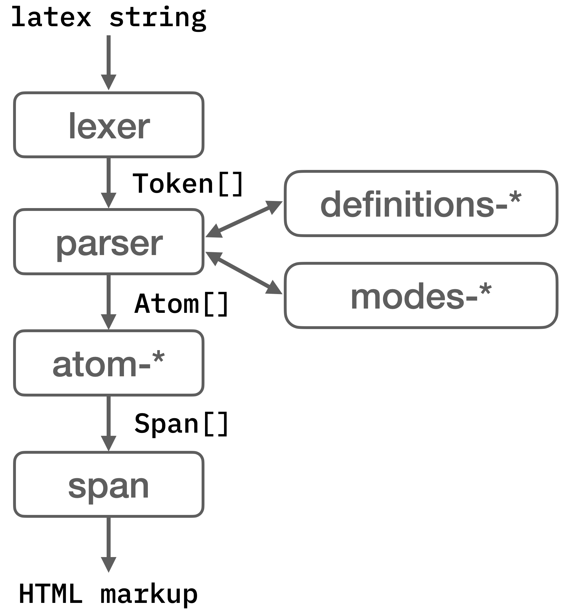
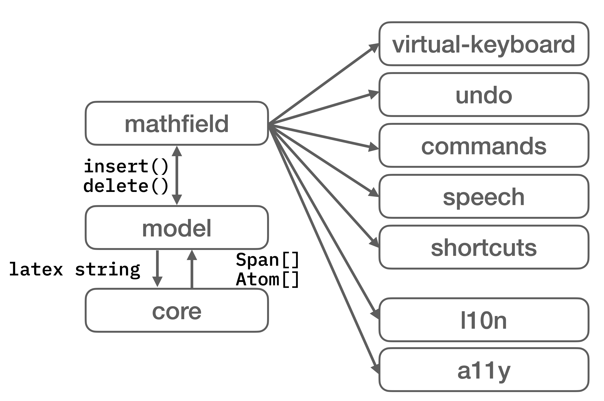

# Contributing to MathLive

There are many ways you can get involved with MathLive. Contributing to an open
source project is fun and rewarding.

## Funding

If you are using MathLive in your project, encourage the business partners in
your organization to provide financial support of open source projects,
including MathLive. Contact [me](arno@arno.org) to discuss possible arrangments
which can run from short-term contracts for specific features or integration
support (I can invoice the work), to one-time or recurring donation to support
the work in general.

Funds go to general development, support, and infrastructure costs.

## Contributing Issues

If you're running into some problems using MathLive or something doesn't behave
the way you think it should, please file an issue in GitHub.

Before filing something, [have a look](https://github.com/arnog/mathlive/issues)
at the existing issues. It's better to avoid filing duplicates. You can add a
comment to an existing issue if you'd like.

To speed up the resolution of an issue, including a pointer to an executable
test case that demonstrates the issue, if applicable.

### Can I help fix a bug?

Sure! Have a look at the issue report, and make sure no one is already working
on it. If the issue is assigned to someone, they're on it! Otherwise, add a
comment in the issue indicating you'd like to work on resolving the issue and go
for it! See the [Language and Coding Style](#language-and-coding-style) section
for coding guidelines.

## Contributing Test Cases

The `test/` folder contains test cases that are used to make sure that bugs are
not introduced as new features are added (regression).

Adding or updating test cases can be very helpful to improve MathLive's quality.
Submit an issue indicating what you'd like to work on, and a pull request when
you have it ready. The test suite uses [Playwright](https://playwright.dev/) for
browser tests and standard `.test.ts` files for unit tests.

## Contributing Ideas and Feature Requests

Use the [issue tracker](https://github.com/arnog/mathlive/issues) to submit
requests for new features. First, have a look at what might already be there,
and if you don't see anything that matches, write up a new issue.

If you do see something similar to your idea, comment on it or add a 👍.

## Contributing Code

Whether you have a fix for an issue, some improved test cases, or a brand new
feature, we welcome contributions in the form of pull requests. Once submitted,
your pull request will be reviewed and you will receive some feedback to make
sure that your pull request fits in with

- the roadmap for MathLive
- the architecture of the project
- the coding guidelines of the project

Once your pull request has been accepted, it will be merged into the master
branch.

Congratulations, you've become a MathLive contributor! Thanks for your help!

## Setting up Your Development Environment

The project uses [NPM scripts](https://docs.npmjs.com/misc/scripts) for its
build system. The `package.json` file and the `scripts/` directory contain the
definitions of the build scripts.

To get started developing:

1. Install [Node.js](http://nodejs.org) on your dev machine (this will also
   install `npm`). The LTS version is recommended.
2. If you're using Windows, you will need to install the `bash` shell. The
   `bash` shell is required and pre-installed on macOS and Linux. For
   instructions on how to install `bash` on Windows, see
   [this article](https://www.howtogeek.com/249966/how-to-install-and-use-the-linux-bash-shell-on-windows-10/).
3. [Fork and clone](https://docs.github.com/en/get-started/quickstart/fork-a-repo)
   this repository, then:

```bash
$ cd mathlive
$ npm ci
```

Depending on your system setup, you may need to run as admin, in which case use
`sudo npm ci` or equivalent.

The `npm ci` command installs in the `mathlive/node_modules` directory all the
Node modules necessary to build and test the MathLive SDK.

Once the installation is successful, you can use the following commands:

```bash
# Start a local dev server with live reload
# After running this command, point your browser to http://127.0.0.1:9029/dist/smoke/
$ npm start

# Make a local development build in the `dist/` directory
$ npm run build

# Run test suite
$ npm test

# Run the linter
$ npm run lint

# Create a production build to `dist/`
$ npm run build production

# Calculate the code coverage and output to `coverage/`
$ npm test coverage
```

During development, keep `npm start` running. A build will be triggered when a
source file is updated. Note however that changes to `.less` files do not
trigger a rebuild. You'll need to stop and restart `npm start`.

### Running tests

To run the test suite locally:

```bash
# Install playwright browsers (once per playwright version)
npx playwright install

# Build, then run the full test suite
npm run build
npm test
```

Note that `npm run build` needs to be run before each `npm test` run. When
debugging the Playwright browser tests, `npx playwright test` can be used to
run only the Playwright tests — in that case `npm run build` is not required,
and the tests can run while the dev server is running.

### Submitting changes

Run the test suite with `npm test` and linter with `npm run lint` to make sure
your changes are ready to submit, then push a PR to the main branch.

### Troubleshooting

If you are getting build errors after updating your repo, your `node_modules/`
directory may need to be updated. Run:

```bash
$ npm ci
```

## Code Structure

The MathLive SDK consists of the following key directories:

- `css/` the stylesheets and fonts
- `sounds/` the default sound files
- `src/core` the core layout engine: parsing LaTeX and rendering it
- `src/atoms` the specific "kinds" of atoms that can be displayed (fractions,
  operators, groups, accents, delimiters, etc.)
- `src/latex-commands` the definitions for the specific LaTeX commands known
  by MathLive
- `src/formats` conversion to other formats (MathML, ASCIIMath, spoken text,
  MathJSON, Typst)
- `src/editor-model` the "state" of the mathfield (its model), including the
  content and selection, and the code to modify it (insert, remove, etc.)
- `src/editor` utilities to handle user interaction, including keybindings,
  shortcuts, localization, text-to-speech, and commands
- `src/editor-mathfield` the outer layer that handles user input and
  interaction with the DOM
- `src/virtual-keyboard` the virtual keyboard implementation
- `src/ui` shared UI components (menus, icons, colors, geometry, i18n)
- `src/common` shared utilities and types
- `src/addons` optional add-ons (static rendering, definitions metadata)
- `src/public` the exposed public API of MathLive, including the
  `MathfieldElement` wrapper class
- `dist/` contains executable build artifacts. If a file named
  `DEVELOPMENT_BUILD` is present in the directory, the content is suitable only
  for development purposes (not minified, includes `.map` files).

The content of the `dist/` directory is entirely generated as part of the build
process. No other directory should contain intermediate files generated as part
of the build process.

## Language and Coding Style

MathLive is written in TypeScript.

The project uses `prettier` and `eslint` to enforce consistent formatting and
coding style. They will be run automatically before commits. You can also run
them manually using `npm run lint`.

The code base attempts to follow these general guidelines:

- **Consistency** All code in the codebase should look as if it had been written
  by a single person. Don't write code for yourself, but for the many people who
  will read it later.
- **Clarity before performance** Write code that is easy to read, and avoid
  obscure constructs that may obfuscate the code to improve performance. For
  example, RegEx are crazy fast in all modern browsers, and trying to roll out
  your own pattern matching will result in more code and less performance. If
  you think something could be made faster, use
  [http://jsben.ch/](http://jsben.ch/) to try out options in various browsers
  and compare the results. You might be surprised.
- **Follow Postel's Law, the Robustness Principle** "Be conservative in what you
  do, be liberal in what you accept from others". For example, functions that
  are invoked internally do not need to check that the input parameters are
  valid. However, public APIs should check the validity of parameters, and
  behave reasonably when they aren't.

## Bundling

The TypeScript code is compiled to JavaScript by the `tsc` compiler. When doing
a production build, the JavaScript is bundled and minimized with `esbuild`. The
CSS files are minimized with `postcss`.

## Browser Support

MathLive is designed for the modern web. Supporting older browsers complicates
the effort involved in building new features, but it is also an insecure
practice that should not be encouraged.

In this context, _modern_ means the latest two releases of Chrome, Edge, Safari
and Firefox. Both desktop and mobile are supported.

Note that the HTML quirks mode is not supported. This means that the host page
should use the strict mode, indicated by a `<!doctype html>` directive at the
top of the page.

Note that the HTML page should use the UTF-8 encoding. Use a server header or a
`<meta charset="UTF-8">` tag in the page if necessary.

## Accessibility - A11Y

### Rendering

MathLive renders math using HTML and CSS. Digits, letters and math symbols are
displayed in `<span>` tags with the necessary CSS styling to display them in the
right place. In addition, rules (lines) such as the fraction line, are rendered
using CSS borders. In a few rare cases, SVG is used to render some decorations,
such as the annotations of the `\enclose` command.

The rendered math is not purely graphical, and as such can be accessed by screen
readers.

### Alternate renditions

In addition to the "visual" HTML+CSS representation that MathLive outputs, it
can also generate alternate renditions, including:

- **LaTeX**: a string of LaTeX code equivalent to the formula.
- **Spoken Text**: a text representation of the formula as someone would speak
  it, for example: `f(x) = x^2` → "f of x equals x squared"
- **Annotated Spoken Text**: as above, but in addition prosody hints are
  inserted for a more natural rendition by text to speech systems (breathing
  pauses, variation in pitch, etc...).

Those alternate renditions are rendered as an ARIA-label, or as an element that
is not visually rendered, but visible to screen readers.

### Speech

Although MathLive works with screen readers, since math is its own language
MathLive has its own built-in text to speech renderer. With the speech interface
it is possible to:

- read the current group (numerator or subscript, for example)
  - Mac: `Ctrl + Command + Down`
  - Windows/Linux/ChromeOS: `Ctrl + Alt + Down`
- read what's before or after the selection
  - Mac: `Ctrl + Command + Left/Right`
  - Windows/Linux/ChromeOS: `Ctrl + Alt + Left/Right`
- read the parent of the current group
  - Mac: `Ctrl + Command + Up`
  - Windows/Linux/ChromeOS: `Ctrl + Alt + Up`
- read the current selection
  - Mac: `Ctrl + Command + Shift + Down`
  - Windows/Linux/ChromeOS: `Ctrl + Alt + Shift + Down`

With these convenient keyboard shortcuts, it is possible to aurally navigate and
understand even complex formulas.

### Input and navigation

MathLive supports multiple modalities for input: in addition to pointer devices
(mouse, trackpad, touch screen), MathLive has an extensive set of keyboard
shortcuts that allow navigation and editing of the most complex formulas. Every
operation is possible without the use of a pointing device.

Conversely, it is possible to enter commands and complex mathematical symbols
using only a pointing device: the command bar can be invoked by tapping a round
toggle button displayed to the right of the formula. The command bar offers
large buttons that act as a virtual keyboard, but offer contextual operations
depending on the current selection, and the content around it. Those buttons are
easy to use on touch screens and for users of alternative pointing devices.

## Architecture

The core of MathLive is a rendering engine that generates HTML (and SVG) markup.
This engine uses the TeX layout algorithms because of their quality. Given the
same input, MathLive will render pixel for pixel (or very close to it) what TeX
would have rendered.

To do so, it makes use of a web version of the fonts used by TeX and which are
included in the `dist/fonts/` directory.

Although the rendering engine follows the TeX algorithms, MathLive also has an
in-memory data structure to represent a math expression while it is being edited
(a tree of `Atom`s).

MathLive is divided into two main components:

- Core: handles rendering of LaTeX to HTML markup
- Editor: handles the user interaction with the formula, using Core for the
  rendering.

### Core

Core takes a LaTeX string as input. A `lexer` converts the string into `Token[]`
which are then passed on to a `parser`. The `parser` uses the information from
`modes-*` to parse the tokens depending on the current mode (text, math,
etc...). The LaTeX commands are defined in `latex-commands/`, and used by the
`parser` to properly interpret the commands it encounters and turn them into
`Atom[]`.

An `Atom` is an elementary layout unit, for example a `genfrac` Atom can layout
a "generalized fraction", that is something with a numerator and denominator,
optionally a bar separating the two, and optionally some opening and closing
fences. It is used by the `\frac` command, but also `\choose`, `\pdiff`
and others.

The `Atom[]` are then turned into `Box[]` which are virtual markup elements.

Eventually, the `Box[]` get rendered into HTML/SVG markup.



### Lexer

The **lexer** converts a string of TeX code into tokens that can be digested by
the parser.

### Parser

The **parser** turns a stream of tokens generated by the lexer into **math
atoms**. Those atoms then can be rendered into **boxes**, or back into LaTeX or
into spoken text.

### Box

A box is virtual DOM node that is used to represent an element displayed in a
web page: a symbol such as _x_ or _=_, an open brace, a line separating the
numerator and denominator of a fraction, etc...

The basic layout strategy is to calculate the vertical placement of the boxes
and position them accordingly, while letting the HTML rendering engine position
and display the horizontal items. When horizontal adjustments need to be made,
such as additional space between items the CSS margin are adjusted.

**boxes** can be rendered to HTML markup with `Box.toMarkup()` before being
displayed on the page.

### Atom

An atom is an object representing a mathematical symbol, for example `x`, `1`, a
fraction, a delimiter, etc...

There are several different classes of Atom (subclass of the base `Atom` class).
Each class represents different layout algorithm (different ways of generating
boxes in their `render()` method) as well as different ways to generate LaTeX to
represent the atom (in their `serialize()` method)

It can be of one of the following classes:

- **Atom**: the base class is used for the simplest symbol, e.g. `x`, `1`,
  `\alpha`
- **AccentAtom**: a diacritic mark above a symbol
- **ArrayAtom**: "environments" in TeX parlance, a matrix, vector or other
  array-like structure
- **BoxAtom**: a decoration around a "nucleus", including a color background,
  lines, etc...
- **DelimAtom** and **SizedDelimAtom** delimiters and extensible delimiters
- see `src/atoms` for more.

### Editor

The `mathfield` is the object handling the user interaction and driving the
rendering of the formula into the document.

It makes use of several subcomponents (`virtual-keyboard`, `undo`, etc...) to
handle specific aspects of the user interaction. It makes changes to the formula
by issuing basic editing commands such as `insert()`, `delete()` and modifying
the selection to the `model`.

The `model` keep track of the state of the formula, including its content (a
tree of `Atom`) and the selection and interacts with the core to turn the `Atom`
into `Box` and into markup.



### Model

The `Model` class encapsulates the operations that can be done to a tree of
atoms, including adding and removing content and keeping track of and modifying
an insertion point and selection.

### Mathfield

The `Mathfield` class is a user interface element that captures the keyboard and
pointing device events, and presents an appropriate user experience.

It uses a `Model` to manipulate the in-memory representation of the math
expression being edited.

## Publish to npm

If you are a maintainer of the project, you can publish a new version of
MathLive to npm. To do so, follow these steps:

```bash
# Update the version number in package.json
npm version patch

# Build the production version of MathLive
npm run dist

# Publish the new version to npm
npm publish ./dist
```
