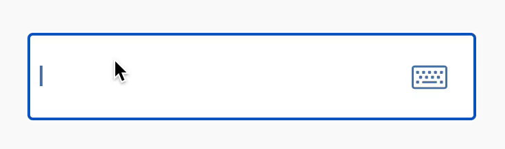
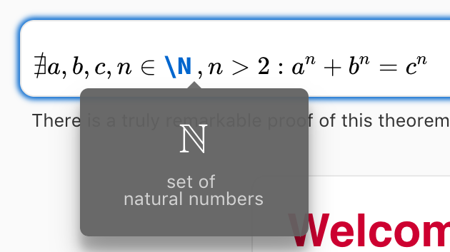
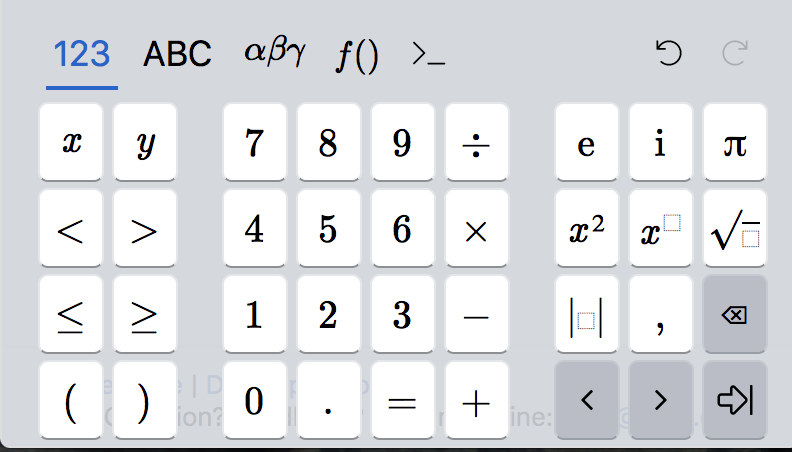
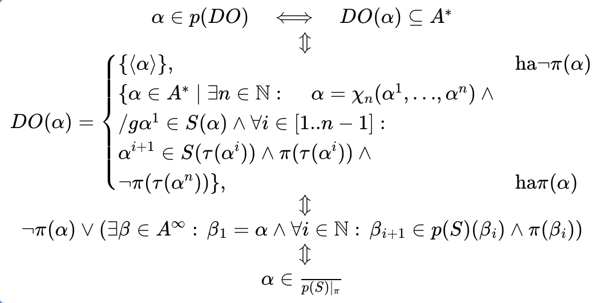

<div align="center">
    
</div>

<h3><strong>MathLive</strong></h3>
<h1>A Web Component for Math Input</h1>

[]()
[](https://raw.githubusercontent.com/arnog/mathlive/master/LICENSE.txt)

MathLive is a powerful web component that provides an easy-to-use interface for
editing math formulas.

With over 800 **built-in LaTeX commands**, MathLive renders beautiful, 
**TeX-quality typesetting**. 

It's designed for **mobile devices** with an extensive set of virtual keyboards 
for math input, and is compatible with screen readers, including custom 
math-to-speech support for improved accessibility. 

MathLive outputs to LaTeX, MathML, ASCIIMath, and MathJSON formats, making it 
incredibly versatile. 

And the best part? It's easy to customize to your needs!



<table align="center" >
    <tr>
        <td width='50%' align='center' style="border:none;">
            
        </td>
        <td width='50%' align='center' style="border:none;">
            
        </td>
    </tr>
    <tr style="background-color: initial; border: none;">
        <td colspan="2" align="center" style="border:none;">
            
        </td>
    </tr>
</table>

## 🚀 Getting Started

Using MathLive is easy! Simply add a `<math-field>` tag to your page. It
initializes automatically and works just like a `<textarea>` or `<button>`
element. You can manipulate the mathfield using methods of the element and
listen for events to be notified when its internal state changes.

`npm install mathlive`

```javascript
import 'mathlive';
```

```html
<!DOCTYPE html>
<html lang="en-US">
  <body>
    <math-field>f(x)=</math-field>
  </body>
</html>
```

You can also add it using CDN
```html
<head>
    <script src="https://unpkg.com/mathlive"></script>
</head>
```

Check documentation for [React](https://cortexjs.io/mathlive/guides/react/) and
[interaction with Mathfield](https://cortexjs.io/mathlive/guides/interacting/). 

## 📖 Documentation

MathLive has an extensive set of documentation to help you get started,
including guides on interacting with a mathfield, customizing it, executing
commands, defining custom LaTeX macros, managing inline and keyboard shortcuts,
controlling speech output, and displaying static math formulas. You can find all
of these guides on the [CortexJS.io website](https://cortexjs.io/mathlive/).

In addition to the guides, you can also find reference documentation of the
MathLive API on the [MathLive SDK page](https://cortexjs.io/docs/mathlive).

## ⋯ Related Projects

<dl>
  <dt><a href="https://cortexjs.io/math-json">MathJSON</a> (on <a href="https://github.com/cortex-js/math-json">GitHub</a>)</dt>
  <dd>A lightweight data interchange format for mathematical notation.</dd>  
  <dt><a href="https://cortexjs.io/compute-engine">Compute Engine</a> (on <a href="https://github.com/cortex-js/math-json/tree/master/src/compute-engine">GitHub</a>)</dt>
  <dd>The CortexJS Compute Engine performs calculations on MathJSON expressions</dd>  
  <dt><a href="https://cortexjs.io/cortex">Cortex</a> (on <a href="https://github.com/cortex-js/math-json/tree/master/src/cortex">GitHub</a>)</dt>
  <dd>Cortex is a programming language for scientific computing</dd>  
</dl>

## 💬 Contact Us

- Chat with the [CortexJS Assistant](https://chat.openai.com/g/g-8YgEfR7ig-cortexjs-assistant)
- Join our [Discord server](https://discord.gg/yhmvVeJ4Hd)
- Drop a line to [arno@arno.org](arno@arno.org)

## 📃 License

This project is licensed under the [MIT License](LICENSE.txt).
