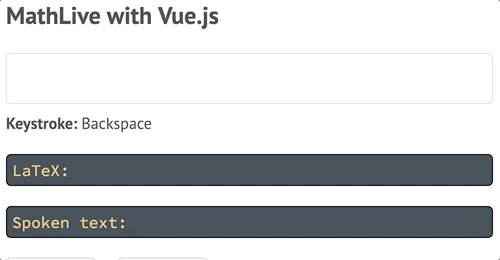

The MathLive Vue wrapper provides a Vue component that implements a `<mathfield>` HTML tag.

The component can be used to edit formulas using the MathLive library. The editor provides a rich, accessible, editing UI, including virtual keyboards for mobile, and can provide the output as LaTeX, MathML or spoken text.

## Getting Started

The MathLive library must be loaded separately. This gives the option to pick a specific version of the library to be used by the wrapper.

Next, the wrapper should be imported, then the two connected using `Vue.use()`

```html
<script type="module">
    import MathLive from './mathlive.js';
    import Mathfield from './vue-mathlive.mjs';

    Vue.use(Mathfield, MathLive);
</script>
```

The default tag for mathfields is `<mathlive-mathfield>`
A custom tag can be defined using:

```javascript
Vue.component('custom-tag', Mathfield);
```

The component supports the `v-model` attribute.

The textual content of the element is used as the initial value of the editor.

```html
<mathlive-mathfield
    :config="{smartFence:false}"
    @focus="ping"
    :on-keystroke="displayKeystroke"
    v-model="formula"
>
    f(x)=
</mathlive-mathfield>
```

### Props

| Name          | Type                                      | Description                                                                                                                                                                                                                                                                                                                            |
| ------------- | ----------------------------------------- | -------------------------------------------------------------------------------------------------------------------------------------------------------------------------------------------------------------------------------------------------------------------------------------------------------------------------------------- |
| `value`       | `string`                                  | The content of the matfield, represented as a LaTeX string.                                                                                                                                                                                                                                                                            |
| `options`     | `object`                                  | Configuration options for the mathfield. See [documentation](http://docs.mathlive.io/module-mathlive.html#makeMathField)                                                                                                                                                                                                               |
| `onKeystroke` | `(keystroke:string, ev:Event) => boolean` | A callback invoked when a key is pressed. `keystroke` is a string describing the keystroke, `ev` is the native keyboard event. Return false to stop handling of the event                                                                                                                                                              |
| `onMoveOutOf` | `(string) => boolean`                     | A callback invoked when keyboard navigation would cause the insertion point to leave the mathfield. The argument indicates the direction of the navigation, either "forward" or "backward". Return false to prevent the move, true to wrap around to the start of the field. By default, the insertion point will wrap around.         |
| `onTabOutOf`  | `(string) => boolean`                     | A callback invoked when pressing tab (or shift-tab) would cause the insertion point to leave the mathfield. The argument indicates the direction of the navigation, either "forward" or "backward". Return false to prevent the move, true to wrap around to the start of the field. By default, the insertion point will wrap around. |

### Events

| Name                      | Description                                                                                                                                                                                          |
| ------------------------- | ---------------------------------------------------------------------------------------------------------------------------------------------------------------------------------------------------- |
| `focus`                   | The editor instance gained the input focus.                                                                                                                                                          |
| `blur`                    | The editor instance lost the input focus.                                                                                                                                                            |
| `input`                   | The content of the mathfield has changed. The parameter of the event is the new value as a string                                                                                                    |
| `selection-will-change`   | The selection of the mathfield is about to change                                                                                                                                                    |
| `undo-state-will-change`  | The undo state is about to change                                                                                                                                                                    |
| `undo-state-did-change`   | The undo state has changed                                                                                                                                                                           |
| `virtual-keyboard-toggle` | The visibility of the virtual keyboard has changed. The first argument is a boolean indicating if the keyboard is now visible. The second argument is a DOM element containing the virtual keyboard. |
| `read-aloud-status`       | The status of the read aloud operation has changed. The first argument is a string indicating the new status.                                                                                        |

### Methods

| Name                                     | Description                                                                                                                                                                                                                                                                                                                                                                                                                                                                                                                                                                                                                                                                                                                                                                                                                                                                                                                                                                                                                                                                                                                           |
| ---------------------------------------- | ------------------------------------------------------------------------------------------------------------------------------------------------------------------------------------------------------------------------------------------------------------------------------------------------------------------------------------------------------------------------------------------------------------------------------------------------------------------------------------------------------------------------------------------------------------------------------------------------------------------------------------------------------------------------------------------------------------------------------------------------------------------------------------------------------------------------------------------------------------------------------------------------------------------------------------------------------------------------------------------------------------------------------------------------------------------------------------------------------------------------------------- |
| `perform(selector:string)`               | Perform an action, as indicated by the selector.                                                                                                                                                                                                                                                                                                                                                                                                                                                                                                                                                                                                                                                                                                                                                                                                                                                                                                                                                                                                                                                                                      |
| `hasFocus(): boolean`                    | True if the matfield is focused                                                                                                                                                                                                                                                                                                                                                                                                                                                                                                                                                                                                                                                                                                                                                                                                                                                                                                                                                                                                                                                                                                       |
| `focus()`                                | Set the focus to the mathfield                                                                                                                                                                                                                                                                                                                                                                                                                                                                                                                                                                                                                                                                                                                                                                                                                                                                                                                                                                                                                                                                                                        |
| `blur()`                                 | Remove the focus from the mathfield                                                                                                                                                                                                                                                                                                                                                                                                                                                                                                                                                                                                                                                                                                                                                                                                                                                                                                                                                                                                                                                                                                   |
| `text(format:string): string`            | Return the content of the mathfield as a string in the specified format: `"latex"`, `"latex-expanded"` (all the LaTeX macros are expanded to their definition), `"spoken"`, `"mathML"`                                                                                                                                                                                                                                                                                                                                                                                                                                                                                                                                                                                                                                                                                                                                                                                                                                                                                                                                                |
| `selectedText(format:string): string`    | Like `text()`, but only for the current selection.                                                                                                                                                                                                                                                                                                                                                                                                                                                                                                                                                                                                                                                                                                                                                                                                                                                                                                                                                                                                                                                                                    |
| `insert(content:string, options:object)` | `options.insertionMode` = `'replaceSelection'` (default), `'replaceAll'`, `'insertBefore'`, `'insertAfter'`<br>`options.selectionMode` - Describes where the selection will be after the insertion: `'placeholder'`: the selection will be the first available placeholder in the item that has been inserted) (default), `'after'`: the selection will be an insertion point after the item that has been inserted, `'before'`: the selection will be an insertion point before the item that has been inserted) or 'item' (the item that was inserted will be selected). <br>`options.placeholder` - The placeholder string, if necessary <br>`options.format` - The format of the string `s`: `'auto'`: the string is interpreted as a latex fragment or command) (default), `'latex'`: the string is interpreted strictly as a latex fragment<br> `options.smartFence` - If true, promote plain fences, e.g. `(`, as `\left...\right` or `\mleft...\mright`<br> `options.suppressChangeNotifications` - If true, the handlers for the contentDidChange and selectionDidChange notifications will not be invoked. Default `false`. |
| `keystroke(keys:string, evt:Event)`      | Simulate a user pressing a key combination                                                                                                                                                                                                                                                                                                                                                                                                                                                                                                                                                                                                                                                                                                                                                                                                                                                                                                                                                                                                                                                                                            |
| `typedText(text:string)`                 | Simulate a user typing some text.                                                                                                                                                                                                                                                                                                                                                                                                                                                                                                                                                                                                                                                                                                                                                                                                                                                                                                                                                                                                                                                                                                     |
| `selectionIsCollapsed():boolean`         | True if the selection is collapsed, i.e. single insertion point                                                                                                                                                                                                                                                                                                                                                                                                                                                                                                                                                                                                                                                                                                                                                                                                                                                                                                                                                                                                                                                                       |
| `selectionDepth():number`                | Return the depth of the selection group. If the selection is at the root level, returns 0. If the selection is a portion of the numerator of a fraction which is at the root level, return 1. Note that in that case, the numerator would be the "selection group"                                                                                                                                                                                                                                                                                                                                                                                                                                                                                                                                                                                                                                                                                                                                                                                                                                                                    |
| `selectionAtStart():boolean`             | Return true if the selection starts at the beginning of the selection group                                                                                                                                                                                                                                                                                                                                                                                                                                                                                                                                                                                                                                                                                                                                                                                                                                                                                                                                                                                                                                                           |
| `selectionAtEnd():boolean`               | Return true if the selection extends to the end of the selection group                                                                                                                                                                                                                                                                                                                                                                                                                                                                                                                                                                                                                                                                                                                                                                                                                                                                                                                                                                                                                                                                |
| `select()`                               | Select the content of the mathfield                                                                                                                                                                                                                                                                                                                                                                                                                                                                                                                                                                                                                                                                                                                                                                                                                                                                                                                                                                                                                                                                                                   |
| `clearSelection()`                       | Collapse the selection in the mathfield                                                                                                                                                                                                                                                                                                                                                                                                                                                                                                                                                                                                                                                                                                                                                                                                                                                                                                                                                                                                                                                                                               |

### Selectors

Selectors can be passed to [`Mathfield.executeCommand()`]{@link Mathfield#executeCommand}
to execute various commands. They can also be associated with keys in virtual
keyboard.

See {@tutorial SELECTORS} for a list of all the selectors.
