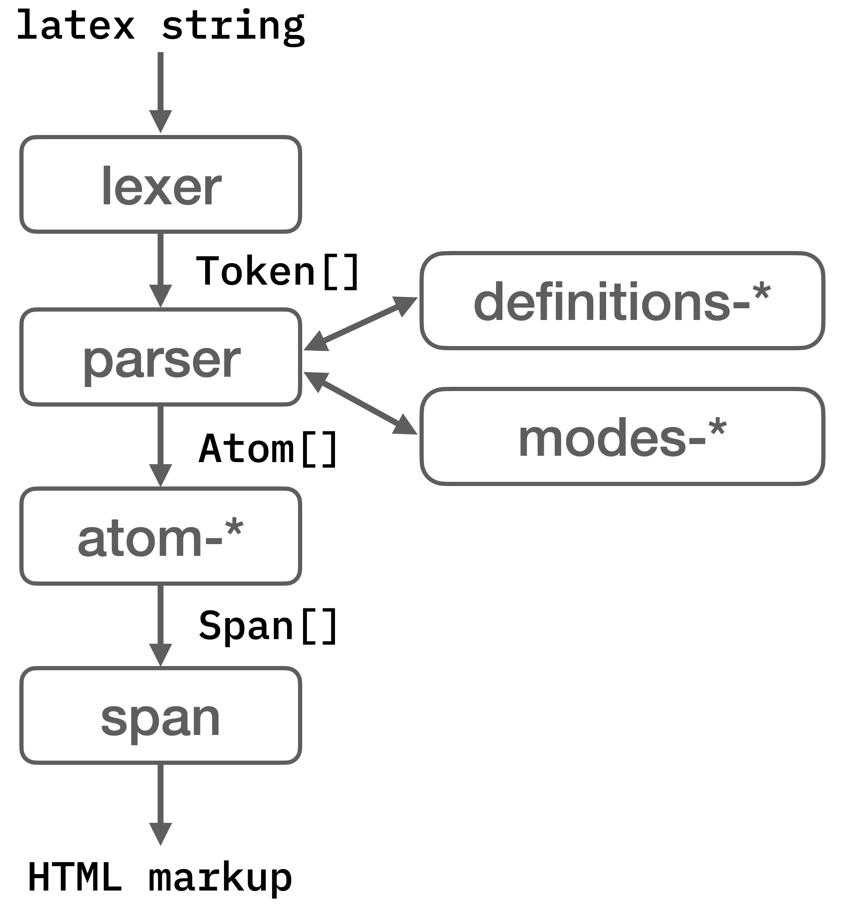
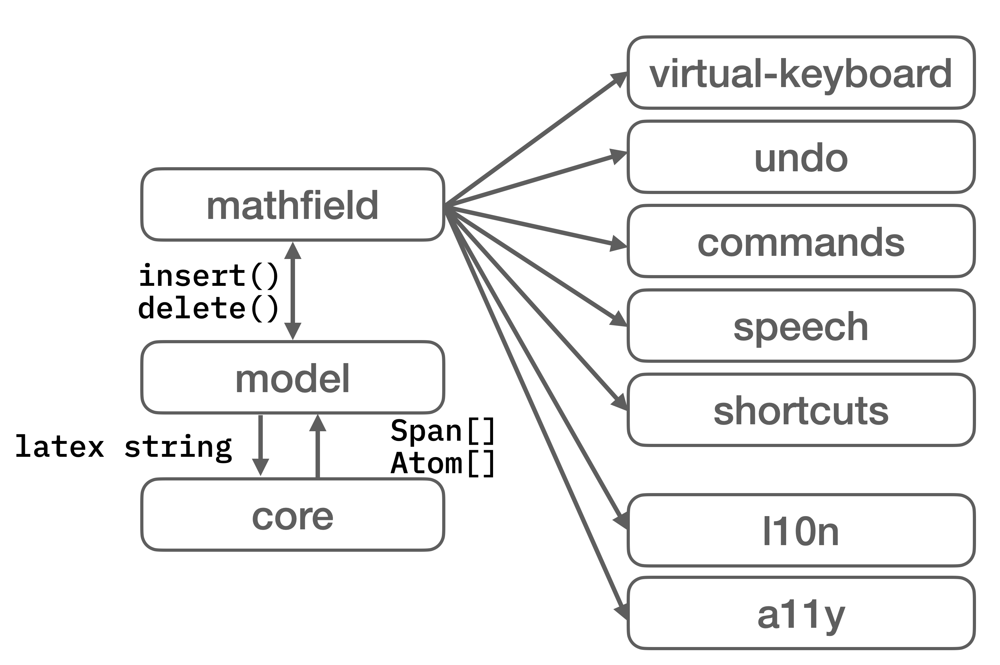

This guide is for developers who want to contribute code to the project, or who
need to modify or debug it.

If you simply want to use MathLive in your project, see the [Usage
Guide](tutorials/USAGE_GUIDE.md).

## Table of Contents

-   [Getting Started: Setting up Your Development
    Environment](#getting-started-setting-up-your-development-environment)
-   [Deploy / Publish](#deploy--publish)
-   [Code Structure](#code-structure)
-   [Language and Coding Style](#language-and-coding-style)
-   [Bundling](#bundling)
-   [Browser Support](#browser-support)
-   [Accessibility](#accessibility-a11y)
-   [Architecture](#architecture)

## Getting Started: Setting up Your Development Environment

The project uses [NPM scripts](https://docs.npmjs.com/misc/scripts) for its
build system. The `package.json` file and the `scripts/` directory contain the
definitions of the build scripts.

To get started developing:

1. Install [Node.js](http://nodejs.org) on your dev machine (this will also
   install `npm`). The LTS version is recommended.
2. In your shell, type:

```bash
$ git clone https://github.com/arnog/mathlive
$ cd mathlive
$ npm ci
```

The `npm ci` command installs in the `mathlive/node_modules` directory all the
Node modules necessary to build and test the MathLive SDK.

Depending on your system setup, you may need to run as admin, in which case use
`sudo npm ci` or equivalent.

If your version of `npm` or `node` is out of date, you will be prompted to
update.

Once the installation is successful, you can use the following commands:

```bash
# Make a local build and watch source file changes and rebuid.
# Run a local server (http://localhost:8080/examples/) to view
# the examples and do some simple debugging
$ npm start


# Make a local development build
# 1. Compile the `.css/.less` file to `build/*.css`
# 2. Compile the TypeScript source files and create
# a bundle with sourcemap in the `dist/` directory
$ npm run build


# Run test suite
$ npm test


# Calculate the code coverage and output to `coverage/`
$ npm test coverage


# Create a production build to `dist/`.
# The `dist/` folder will contain the `.js`, `.css` and
# font files necessary to use MathLive.
$ npm run build production

```

During development, keep `npm start` running. A build will be triggered when a
source file is updated. Note however that changes to `.less` files do no trigger
a rebuild. You'll need to stop and restart the `npm start` command.

### Submitting changes

Run the test suite with `npm test` and linter `npm run lint` to make sure your
changes are ready to submit, then push a PR to the main branch

After you push your changes to `main`, a Travis continuous integration task will
run on a remote server to make sure the build can be reproduced in a clean
environment.

### Troubleshooting

If you are getting build errors after updating your repo, your `node-modules/`
directory may need to be updated. Run:

```bash
$ npm ci
```

## Deploy / Publish

**Note**: only the owner of the project should deploy to NPM.

You will need a `GH_PUBLIC_TOKEN` env variable set up with a "Personal Access
Token" to publish the GitHub Release.

Go to GitHub > [user] > Settings > Developer Settings > Personal Access Tokens
to create one and set it as a shell env global variable.

To publish a new version of the SDK:

```bash
# Increase the version number of the SDK
# and publish a GitHub release
$ npm version [major | minor | patch]

# Publish to NPM
$ npm publish
```

These commands will:

1. Increment the version number of the SDK and create a corresponding git tag
2. Update the CHANGELOG with the current version number
3. Publish a GitHub release
4. Publish to NPM

(See `scripts/version.sh`, which is invoked by `npm version`)

**Note on versioning:** Use the [semver](http://semver.org/) convention for
versions:

-   `npm version patch`: bug fixes and other minor changes. Last number of the
    version is incremented, e.g. `1.2.41` → `1.2.42`
-   `npm version minor`: new features which don't break existing features.
    Middle number of the version is incremented, e.g. `1.2.42` → `1.3.0`
-   `npm version major`: changes which break backward compatibility of the API.
    Increment the first number, e.g. `1.3.56` → `2.0.0`

## Code Structure

The MathLive SDK consists of the following key directories:

-   `css/` the stylesheets and fonts
-   `sounds/` the default sound files
-   `src/core`, `src/core-atoms`, `src/core-definitions` the core JavaScript
    code needed to render math. This module depends on the `css/` module.
-   `src/editor`, `src/editor-mathfield`, `src/editor-model` the JavaScript code
    needed for the editor. This module depends on the `src/core*` modules.
-   `src/addons` some optional modules that provide additional functionality

-   the `dist/` directory contains executable build artifacts. If a file named
    "DEVELOPMENT_BUILD" is present in the directory, the content of the
    directory is suitable only for development purposes, not for production.
    This means the files have not been minified and compiled, and include
    additional .map files referencing back to the source file for ease of
    debugging.

The content of the `dist/` directory are entirely generated as part of the build
process. No other directory should contain intermediated files generated as part
of the build process.

## Language and Coding Style

MathLive is written in TypeScript.

The project uses the `prettier` tool to enforce a consistent formatting style
and naming conventions. The tool will be run automatically before commits. You
can also run it manually using `npm run lint`.

The code base attempts to follow these general guidelines:

-   **Consistency** All code in the codebase should look as if it had been
    written by a single person. Don't write code for yourself, but for the many
    people who will read it later.
-   **Clarity before performance** Write code that is easy to read, and avoid
    obscure constructs that may obfuscate the code to improve performance. For
    example, RegEx are crazy fast in all modern browsers, and trying to roll out
    your own pattern matching will result in more code and less performance. If
    you think something could be made faster, use
    [http://jsben.ch/](http://jsben.ch/) to try out options in various
    browsers and compare the results. You might be surprised.
-   **Follow Postel's Law, the Robustness Principle** "Be conservative in what
    you do, be liberal in what you accept from others". For example, functions
    that are invoked internally do not need to check that the input parameters
    are valid. However, public APIs should check the validity of parameters, and
    behave reasonably when they aren't.

## Bundling

The TypeScript code is compiled to JavaScript by the `tsc` compiler. When doing
a production build, the JavaScript is further minimized with `terser`, then
bundled into a single file with `rollup`. The CSS files are minimized with
`postcss`.

## Browser Support

MathLive is designed for the modern web. Supporting older browsers complicates
the effort involved in building new features, but it is also an insecure
practice that should not be encouraged.

In this context, _modern_ means the latest two releases of Chrome, Edge, Safari
and Firefox. Both desktop and mobile are supported.

Note that the HTML quirks mode is not supported. This means that the host page
should use the strict mode, indicated by a `<!doctype html>` directive at the
top of the page.

Note that the HTML page should use the UTF-8 encoding. Use a server header or a
`<meta charset="UTF-8">` tag in the page if necessary.

## Accessibility - A11Y

### Rendering

MathLive renders math using HTML and CSS. Digits, letters and math symbols are
displayed in `<span>` tags with the necessary CSS styling to display them in the
right place. In addition, rules (lines) such as the fraction line, are rendered
using CSS borders. In a few rare cases, SVG is used to render some decorations,
such as the annotations of the `\enclose` command.

The rendered math is not purely graphical, and as such can be accessed by screen
readers.

### Alternate renditions

However, in addition to the "visual" HTML+CSS representation that MathLive
outputs, it can also generate alternate renditions, including:

-   **LaTeX**: a string of LaTeX code equivalent to the formula.
-   **Spoken Text**: a text representation of the formula as someone would speak
    it, for example: `f(x) = x^2` → "f of x equals x squared"
-   **Annotated Spoken Text**: as above, but in addition prosody hints are
    inserted for a more natural rendition by text to speech systems (breathing
    pauses, variation in pitch, etc...).

Those alternate renditions are rendered as an ARIA-label, or as an element that
is not visually rendered, but visible to screen readers.

### Speech

Although MathLive works with screen readers, since math is its own language
MathLive has its own built-in text to speech renderer. With the speech interface
it is possible to:

-   read the current group (numerator or subscript, for example)
    -   Mac: `Ctrl + Command + Down`
    -   Windows/Linux/ChromeOS: `Ctrl + Alt + Down`
-   read what's before or after the selection
    -   Mac: `Ctrl + Command + Left/Right`
    -   Windows/Linux/ChromeOS: `Ctrl + Alt + Left/Right`
-   read the parent of the current group
    -   Mac: `Ctrl + Command + Up`
    -   Windows/Linux/ChromeOS: `Ctrl + Alt + Up`
-   read the current selection
    -   Mac: `Ctrl + Command + Shift + Down`
    -   Windows/Linux/ChromeOS: `Ctrl + Alt + Shift + Down`

With these convenient keyboard shortcuts, it is possible to aurally navigate and
understand even complex formulas.

### Input and navigation

MathLive supports multiple modalities for input: in addition to pointer devices
(mouse, trackpad, touch screen), MathLive has an extensive set of keyboard
shortcuts that allow navigation and editing of the most complex formulas. Every
operation is possible without the use of a pointing device.

Conversely, it is possible to enter commands and complex mathematical symbols
using only a pointing device: the command bar can be invoked by tapping a round
toggle button displayed to the right of the formula. The command bar offers
large buttons that act as a virtual keyboard, but offer contextual operations
depending on the current selection, and the content around it. Those buttons are
easy to use on touch screens and for users of alternative pointing devices.

## Architecture

The core of MathLive is a rendering engine that generates HTML (and SVG) markup.
This engine uses the TeX layout algorithms because of their quality. Given the
same input, MathLive will render pixel for pixel (or very close to it) what TeX
would have rendered.

To do so, it makes use of a web version of the fonts used by TeX and which are
included in the `dist/fonts/` directory.

Although the rendering engine follows the TeX algorithms, MathLive also has an
in-memory data structure to represent a math expression while it is being edited
(a tree of `Atom`s).

MathLive is divided into two main components:

-   Core: handles rendering of Latex to HTML markup
-   Editor: handles the user interaction with the formula, using Core for the
    rendering.

### Core

Core takes a Latex string as input. A `lexer` converts the string into `Token[]`
which are then passed on to a `parser`. The `parser` uses the information from
`modes-*` to parse the tokens depending on the current mode (text, math,
etc...). The Latex commands are defined in `definitions-*`, and used by the
`parser` to properly interpret the commands it encounter and turn them into
`Atom[]`.

An `Atom` is an elementary layout unit, for example a `genfrac` Atom can layout
a "generalized fraction", that is something with a numerator and denominator,
optionally a bar separating the two, and some optionally some opening and
closing fences. It is used by the `\frac` command, but also `\choose`, `\pdiff`
and others.

The `Atom[]` are then turned into `Span[]` which are virtual markup elements.

Eventually, the `Span[]` get rendered into HTML/SVG markup.



### Lexer

The **lexer** converts a string of TeX code into tokens that can be digested by
the parser.

### Parser

The **parser** turns a stream of tokens generated by the lexer into **math
atoms**. Those atoms then can be rendered into **spans**, or back into LaTeX or
into spoken text.

### Span

A span is an virtal DOM node that is used to represent an element displayed in a
web page: a symbol such as _x_ or _=_, an open brace, a line separating the
numerator and denominator of a fraction, etc...

The basic layout strategy is to calculate the vertical placement of the spans
and position them accordingly, while letting the HTML rendering engine position
and display the horizontal items. When horizontal adjustments need to be made,
such as additional space between items the CSS margin are adjusted.

**Spans** can be rendered to HTML markup with `Span.toMarkup()` before being
displayed on the page.

### Atom

An atom is an object representing a mathematical symbol, for example `x`, `1`, a
fraction, a delimiter, etc...

There are several different classes of Atom (subclass of the base `Atom` class).
Each class represents different layout algorithm (different ways of generating
spans in their `render()` method) as well as different ways to generate Latex to
represent the atom (in their `toLatex()` method)

It can be of one of the following classes:

-   **Atom**: the base class is used for the simplest symbol, e.g. `x`, `1`,
    `\alpha`
-   **AccentAtom**: a diacritic mark above a symbol
-   **ArrayAtom**: "environments" in TeX parlance, a matrix, vector or other
    array-like structure
-   **BoxAtom**: a decoration around a "nucleus", including a color background,
    lines, etc...
-   **DelimAtom** and **SizedDelimAtom** delimiters and extensible delimiters
-   see `src/core-atoms` for more.

### Editor

The `mathfield` is the object handling the user interaction and driving the
rendering of the formula into the document.

It makes use of several subcomponents (`virtual-keyboard`, `undo`, etc...) to
handle specific aspects of the user interaction. It makes changes to the formula
by issuing basic editing commands such as `insert()`, `delete()` and modifying
the selection to the `model`.

The `model` keep track of the state of the formula, including its content (a
tree of `Atom`) and the selection and interacts with the core to turn the `Atom`
into `Span` and into markup.



### Model

The `Model` class encapsulates the operations that can be done to a tree of
atoms, including adding and removing content and keeping track of and modifying
an insertion point and selection.

### Mathfield

The `Mathfield` class is a user interface element that captures the keyboard and
pointing device events, and presents an appropriate user experience.

It uses a `Model` to manipulate the in-memory representation of the math
expression being edited.
